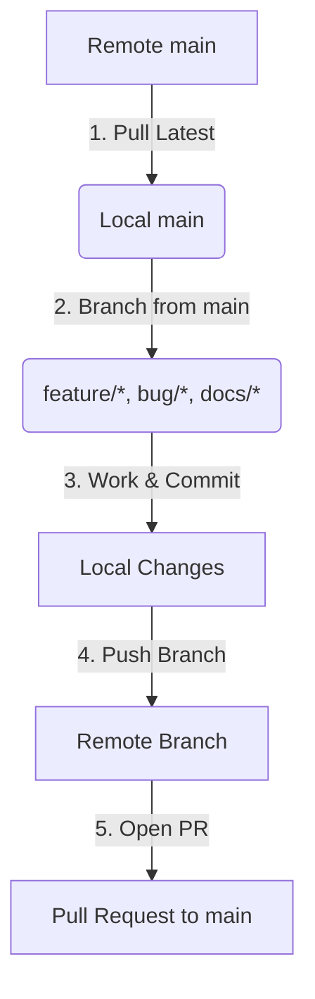

# Agent Developer Guide

Welcome to the **PC Dashboard Server** repository! As an agentic AI developer, you must follow these rules strictly to ensure smooth development, safe code deployments, and respect for branch protection rules on the remote repository.

---

## 🛠️ General Environment & Workflow Rules

Before performing any tasks in this repository, you must adhere to the following rules regarding your execution environment:

* 📦 **Devcontainer Environment**: All work must be performed inside the provided Devcontainer (`.devcontainer`). This is the expected and required environment.
* 🛑 **Environment Verification**: If you detect that you are not running inside the Devcontainer, you must **stop immediately and report an error to the user**.
* 🛡️ **No Container Escapes**: Never attempt to escape, bypass, or run commands outside of the Devcontainer environment.
* 🔍 **Tool Validation & Reporting**: Always verify that all expected development tools are present and function as intended. If any expected tools are absent or do not work as intended, **stop and report the issue to the user**. Do not attempt to install system-level packages or work around missing system dependencies; these issues must be resolved by the user.

---

## 📌 Core Rules & Workflow

The `main` branch is **protected** on the remote repository. Direct push access to `main` is blocked. You must always work on separate feature, bug, or documentation branches and submit pull requests.



### 1. Synchronize with Remote `main`
Before starting any new work or creating a new branch, always ensure your local `main` branch is fully up-to-date with the remote repository. This prevents merge conflicts and ensures you are building on top of the latest stable code.

```bash
# Switch to main branch
git checkout main

# Pull the latest changes from the remote
git pull origin main
```

### 2. Choose an Appropriate Branch Name
Create a new branch from the updated `main` branch. All branch names **must** be prefixed according to the nature of the changes:

| Prefix | Description | Example |
| :--- | :--- | :--- |
| `feature/` | New features, enhancements, or additions | `feature/add-system-metrics` |
| `bug/` | Bug fixes, patches, and error corrections | `bug/fix-memory-leak` |
| `docs/` | Documentation additions or updates | `docs/add-git-workflow` |
| `refactor/` | Code restructuring without behavior changes | `refactor/cleanup-cmd-structure` |
| `test/` | Adding or updating tests | `test/add-api-unit-tests` |
| `ci/` | GitHub Actions, DevOps, Dependabot configuration | `ci/update-dependabot` |

Create and switch to your new branch:
```bash
git checkout -b <prefix>/<brief-description>

# Example:
git checkout -b docs/agent-git-workflow
```

### 3. Make and Commit Your Changes
While working, keep your commits clean, focused, and well-described.
* Ensure the code compiles and tests pass before committing.
* Write clear, concise commit messages.

```bash
git add .
git commit -m "docs: describe git workflow for AI agents in agents.md"
```

### 4. Push and Create a Pull Request
Push your branch to the remote repository. Since `main` is protected, this branch will be published on the origin, where a Pull Request (PR) can be opened and reviewed.

```bash
git push -u origin <branch-name>
```

---

## 💡 Best Practices for Agents

> [!IMPORTANT]
> **Never attempt to push directly to `main`**: If you do, the remote server will reject your push due to protection rules. Always use a dedicated branch.

> [!TIP]
> **Keep branches short-lived**: Focus on single, granular tasks per branch to keep Pull Requests small, easy to review, and easy to merge.

* 🔄 **Rebase regularly**: If the `main` branch has moved forward while you were working on your branch, rebase your branch on top of `main` to resolve conflicts locally:
  ```bash
  git checkout main
  git pull origin main
  git checkout your-branch
  git rebase main
  ```
* 🧪 **Verify changes**: Run tests and lint checks locally before pushing your changes to ensure code quality.
