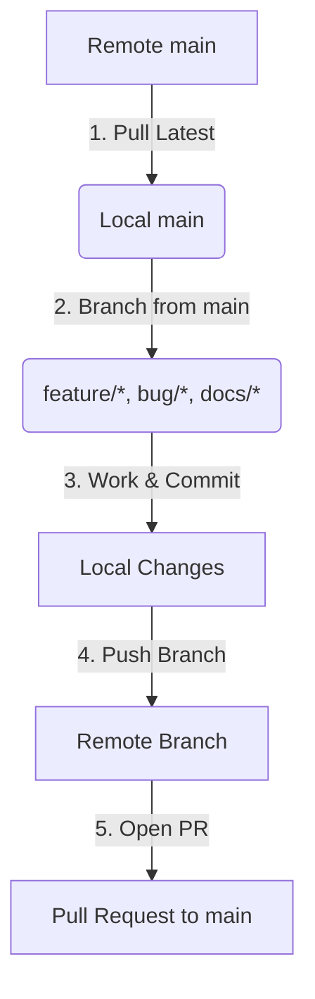
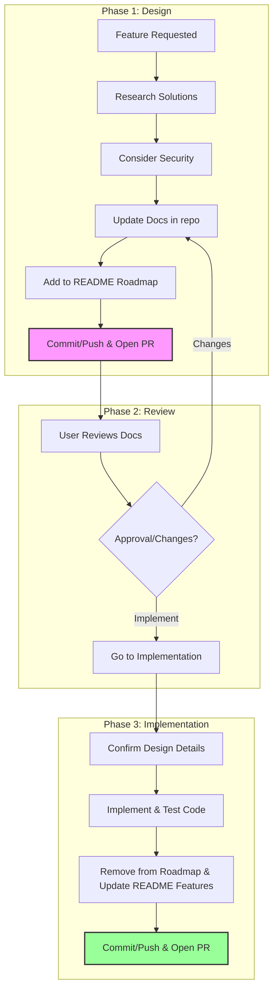

# Agent Developer Guide

Welcome to the **PC Dashboard Server** repository! As an agentic AI developer, you must follow these rules strictly to ensure smooth development, safe code deployments, and respect for branch protection rules on the remote repository.

---

## 🛠️ General Environment & Workflow Rules

Before performing any tasks in this repository, you must adhere to the following rules regarding your execution environment:

* 📦 **Devcontainer Environment**: All work must be performed inside the provided Devcontainer (`.devcontainer`). This is the expected and required environment.
* 🛑 **Environment Verification**: If you detect that you are not running inside the Devcontainer, you must **stop immediately and report an error to the user**.
* 🛡️ **No Container Escapes**: Never attempt to escape, bypass, or run commands outside of the Devcontainer environment.
* 🔍 **Tool Validation & Reporting**: Always verify that all expected development tools are present and function as intended. If any expected tools are absent or do not work as intended, **stop and report the issue to the user**. Do not attempt to install system-level packages or work around missing system dependencies; these issues must be resolved by the user.

---

## 📌 Core Rules & Workflow

The `main` branch is **protected** on the remote repository. Direct push access to `main` is blocked. You must always work on separate feature, bug, or documentation branches and submit pull requests.



### 1. Synchronize with Remote `main`
Before starting any new work or creating a new branch, always ensure your local `main` branch is fully up-to-date with the remote repository. This prevents merge conflicts and ensures you are building on top of the latest stable code.

```bash
# Switch to main branch
git checkout main

# Pull the latest changes from the remote
git pull origin main
```

### 2. Choose an Appropriate Branch Name
Create a new branch from the updated `main` branch. All branch names **must** be prefixed according to the nature of the changes:

| Prefix | Description | Example |
| :--- | :--- | :--- |
| `feature/` | New features, enhancements, or additions | `feature/add-system-metrics` |
| `bug/` | Bug fixes, patches, and error corrections | `bug/fix-memory-leak` |
| `docs/` | Documentation additions or updates | `docs/add-git-workflow` |
| `refactor/` | Code restructuring without behavior changes | `refactor/cleanup-cmd-structure` |
| `test/` | Adding or updating tests | `test/add-api-unit-tests` |
| `ci/` | GitHub Actions, DevOps, Dependabot configuration | `ci/update-dependabot` |

Create and switch to your new branch:
```bash
git checkout -b <prefix>/<brief-description>

# Example:
git checkout -b docs/agent-git-workflow
```

### 3. Make and Commit Your Changes
While working, keep your commits clean, focused, and well-described.
* Ensure the code compiles and tests pass before committing.
* **Pre-Commit Verification**: You MUST run formatting, unit tests, and static checks before *every* commit:
  ```bash
  go fmt ./...
  go test -v ./...
  go vet ./...
  ```
* Write clear, concise commit messages. **Do NOT** add any "co-authored by AI/LLM Agent" statements to your commits, as this is already covered by the global notice in the repository's `README.md`.
* ⚠️ **Preserve Your Work**: Never blindly discard changes. When in doubt, stop and ask the user. If you are sure the changes are going to be needed later, stash them using `git stash`.


```bash
git add .
git commit -m "docs: describe git workflow for AI agents in AGENTS.md"
```

### 4. Push and Create a Pull Request
When the work is done, always commit and push the branch to the remote repository. Since `main` is protected, this branch will be published on the origin. After a successful push, use the GitHub MCP or the `gh` CLI tool to open a Pull Request (PR) that will be reviewed by the user.

```bash
# Push the branch to remote
git push -u origin <branch-name>

# Open a PR using gh CLI (or use GitHub MCP)
gh pr create --title "docs: describe git workflow for AI agents" --body "Proposed changes to agent documentation."
```

---

## 🔄 Feature Development Workflow

When implementing new features in this repository, you must strictly follow a three-phase workflow: **Design**, **Review**, and **Implementation**. Under no circumstances should source code implementation begin until the design phase has been completed and approved by the user.



### 1. Design Phase
When a new feature is requested, start by laying the technical and architectural foundation. **No implementation or source code modifications should take place at this stage.**
1.  **Research & Feasibility**: Conduct thorough research to find best-effort, reasonable, and robust solutions. Outline the technical specifications.
2.  **Security Review**: Carefully consider the security implications of the new feature (e.g., trust boundaries, sensitive data pathways, and loopback safety) and document them.
3.  **Update Documentation**: Update the existing markdown documentation in the repository (e.g., under `docs/` or `README.md`) to comprehensively describe the planned architecture, protocol changes, and behavior.
4.  **Add to Roadmap**: Add the proposed feature to the **Roadmap** section of `README.md` with a small, clear summary of its scope and status (e.g., `*[Design Phase]*`).
5.  **Submit for Review**: Commit the documentation changes, push the branch, and open a Pull Request (PR). **When opening the PR for design work, always include a comprehensive summary of the design proposal inside the PR description.**

### 2. Review Phase
During this phase, the user reviews the updated documentation to evaluate the proposed design.
1.  **Wait for Feedback**: Do not proceed to write application code.
2.  **Iterate on Design**: If the user requests changes, clarify questions or refine the documentation, committing updates to the same branch.
3.  **Transition**: This phase concludes when the user explicitly approves the design and requests the feature implementation.

### 3. Implementation Phase
When the user asks for the feature implementation to proceed:
1.  **Confirm Details**: Review and confirm the exact technical details and schemas established during the Design Phase.
2.  **Develop & Test**: Implement the production code and corresponding automated tests, verifying everything passes within the devcontainer.
3.  **Update README**:
    *   Remove the feature from the **Roadmap** section of `README.md`.
    *   Add the feature under the appropriate section in the **Features** list of `README.md`. If no existing section fits, create a new section.
4.  **Submit PR**: Commit your code, tests, and the README updates, push to the remote, and open a PR for merging.

---

## 💡 Best Practices for Agents

> [!IMPORTANT]
> **Never attempt to push directly to `main`**: If you do, the remote server will reject your push due to protection rules. Always use a dedicated branch.

> [!TIP]
> **Keep branches short-lived**: Focus on single, granular tasks per branch to keep Pull Requests small, easy to review, and easy to merge.

* 📥 **Never blindly discard changes**: When in doubt about whether a change is needed, stop and ask the user. If the changes are going to be needed later, stash them (`git stash`).
* 📝 **No AI Attribution in Commits**: Do not add "co-authored by AI agent" or similar statements to your commit messages or code files, as the project's root `README.md` already contains a global notice regarding LLM co-authorship.
* 🔄 **Rebase regularly**: If the `main` branch has moved forward while you were working on your branch, rebase your branch on top of `main` to resolve conflicts locally:
  ```bash
  git checkout main
  git pull origin main
  git checkout your-branch
  git rebase main
  ```
* 🧪 **Verify changes**: Run the formatter (`go fmt ./...`), tests (`go test -v ./...`), and lint checks (`go vet ./...`) locally before *every* commit to ensure absolute code quality and prevent CI build breaks.

---

## 🗺️ Repository Map & Architectural Context

To keep your session context small and avoid wasting tokens scanning the repository, refer to this architectural blueprint:

### 1. Document Index
*   **[specifications.md](file:///workspaces/pc-dashboard-server/docs/specifications.md)**: Core features, telemetry schemas, and systemd config guidelines.
*   **[design_document.md](file:///workspaces/pc-dashboard-server/docs/design_document.md)**: Library matrices (Koanf, Gorilla, gopsutil), modular interfaces, and package interactions.
*   **[protocol_specification.md](file:///workspaces/pc-dashboard-server/docs/protocol_specification.md)**: Byte-level length-prefixed ADB frame specification and bidirectional WebSocket JSON payloads.
*   **[testing_and_emulation.md](file:///workspaces/pc-dashboard-server/docs/testing_and_emulation.md)**: Wave telemetry formulas, mock hotplug algorithms, host network bridges (`host.docker.internal`), and unit-test socket mocking.

### 2. Standard Directory Layout
When implementing the codebase, organize logic strictly within these single-responsibility packages:
```
pc-dashboard-server/
├── cmd/                          # Cobra CLI command routers (e.g. root.go, start.go)
└── pkg/
    ├── config/                   # Strongly-typed Koanf configuration loader
    ├── metrics/                  # Telemetry Reader interface & implementations (Host, Mock)
    ├── adb/                      # ADB client interface, tracking event stream, & TCP driver
    ├── websocket/                # Multi-client pool & loopback WebSocket server
    └── daemon/                   # Daemon orchestrator binding ADB, Metrics, and WebSockets
```

### 3. Core Architectural Constraints
*   **Interface-First Design**: Production code and mock systems are decoupled via interfaces. Hardware telemetry uses `MetricsReader`. Android USB interactions use `ADBClient`.
*   **Emulation Engines**: Tests and virtualized containers run in Emulation Mode via `--emulate-metrics` (smooth wave algorithms) and `--mock-adb` (simulated physical device connection ticks).
*   **Network Bound Safety**: Under no circumstance should the WebSocket server bind outside the local loopback boundary (`127.0.0.1`).
*   **ADB Socket Protocol**: The production client communicates strictly over raw TCP connection streams on port `5037` (or `host.docker.internal:5037` in Devcontainers) using length-prefixed ADB protocol headers. **Do not invoke external `adb` CLI shell binaries.**
*   **Android Package**: The client companion app package name is strictly: `com.noosxe.pc_dashboard`.

