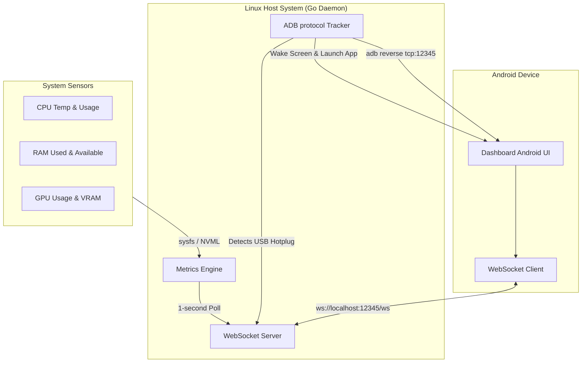

# PC Dashboard Server

A Go-based server designed for system monitoring, metrics collection, and dashboard services.

> [!WARNING]
> **LLM Agent Co-Authored Codebase**
> The code, documentation, and configuration in this repository are co-authored by an LLM (Large Language Model) Agent. This is a blanket notice for anyone interested in exploring, reviewing, or using this codebase: some code patterns, logic, or scripts may have been generated or updated by an AI agent under user direction. Please review all code carefully before executing or utilizing it in a production environment.

## 🚀 Overview

**PC Dashboard Server** is a lightweight, low-overhead system daemon written in Go for Linux host systems. It works in tandem with a companion Android application ([com.noosxe.pc_dashboard](https://github.com/noosxe/pc-dashboard-app)) to transform any Android mobile device connected via USB into a dedicated, real-time hardware status monitor and dashboard.

By using physical USB connections instead of local Wi-Fi networks, the system achieves sub-millisecond network latencies, eliminates wireless bandwidth contention, runs securely inside local host loops, and is completely isolated from external network eavesdropping or packet injection.

---

## ✨ Features

- **⚡ Lightweight Telemetry Engine**: Asynchronously polls system statistics (CPU, RAM, and GPU) at a steady 1-second interval with less than 15MB of RAM footprint.
- **🚀 CPU/GPU/VRAM Frequency Telemetry**: Dynamically extracts active core speeds, graphics engine clock rates, and VRAM memory clock rates (in MHz) every second. Queries average active CPU frequencies via Linux `/sys` scaling interfaces or `gopsutil` CPU core fallbacks. For graphics processors, utilizes custom active frequency sysfs interfaces or dynamic DPM system clock registers for AMD/Intel, alongside CGO-free NVML bindings or structured `nvidia-smi` parses for NVIDIA. Includes full integration with local Unix Domain Socket (UDS) trigger capabilities (`--cpu-freq`, `--gpu-freq`, and `--gpu-vram-freq`).
- **🔌 CPU/GPU/VRAM Power & Thermal Telemetry**: Gathers package-level CPU power draw, active GPU power consumption, GPU core/edge temperature, and VRAM memory/junction temperature. Accesses CPU power via the unified Linux RAPL sysfs interface (`/sys/class/powercap/intel-rapl`), which natively maps to both Intel and AMD Zen-based processors on modern kernels. For graphics processors, leverages NVML or `nvidia-smi` parameters for NVIDIA GPUs, and queries `sysfs` hwmon paths for AMD/Intel graphics cards, including reading VRAM junction temperatures via hwmon labels (e.g. `temp*_label` matching `mem`, `vram`, or `junction`). Includes a graceful fallback if permissions are restricted (omitting power/thermal fields instead of crashing) and full integration with local UDS trigger commands (`--cpu-power`, `--gpu-power`, and `--gpu-vram-temp`).
- **🔌 Native ADB Hotplug Tracking**: Directly communicates with the ADB server (`127.0.0.1:5037`) over TCP sockets to monitor USB connections dynamically.
- **📱 Automatic Bootstrapping & Bypassing**:
  - Automatically wakes up the connected device's screen (`KEYCODE_WAKEUP`).
  - Launches the companion Android application activity (`com.noosxe.pc_dashboard`).
  - Registers a reverse TCP forward tunnel (`reverse:forward:tcp:12345;tcp:12345`), routing the USB communication securely.
  - Supports `--no-app-control` configuration flag to bypass automatic screen wakeup and app launch/cleanup routines for manual debugging sessions.
- **🎵 MPRIS Media Player Control & Local Artwork Sync (D-Bus)**: Dynamic monitoring and control of active media players (e.g. Spotify, VLC, Firefox) on the host PC. Intercepts metadata, playback status, volume, and progress, and dispatches real-time WebSocket control commands back to system players via standard D-Bus session interfaces. Features a **Tiered Friendly Name Resolution Engine** that maps raw service name suffixes (like `"firefox.instance_1_63"`) to proper human-readable application names (like `"Mozilla zen"` or `"Zen Browser"`) by querying MPRIS branding properties, parsing XDG `.desktop` files, and performing process executable lookups. Includes an **Artwork Extraction & Encoding Engine** that automatically detects local filesystem paths or `file://` URIs inside the track metadata (such as VLC/browser local playbacks) and converts them into Base64-encoded Data URLs (`data:image/...;base64,...`) cached in memory, ensuring remote companion dashboard apps can display album/track artwork seamlessly.
- **🔔 Desktop Notifications Sync & Icon Delivery (D-Bus)**: Bi-directional synchronization of desktop notifications with the host system D-Bus. Captures outbound notifications via session monitoring, and triggers standard host desktop notifications from inbound WebSocket commands. Features a **2-Tier Icon Resolution & Delivery Pipeline** that asynchronously extracts application icons and custom image avatars from D-Bus hints (raw pixel arrays), absolute filesystem paths, and XDG desktop themed lookups, encoding them into compressed Base64 PNGs/SVGs for instantaneous recognition on the companion app.
- **🔒 Session Lock & Telemetry Throttle (D-Bus)**: Event-driven interception of host user session lock and unlock transitions via systemd-logind system bus and screensaver session bus signals. When locked, the companion Android dashboard remains awake but transitions into a low-power, customized dashboard lockscreen UI to prevent burn-in. Telemetry update frequency is dynamically throttled to a configurable rate (default 5s) during locks to conserve host CPU and tablet battery. Caches the last known lock state in memory to instantly synchronize newly connected clients.
- **🖥️ Display Power Management (DPMS) ADB Screen Sync**: Event-driven tracking of host physical display power events (On/Off) via native D-Bus properties for GNOME/Mutter (`PowerSaveMode`) and KDE/Plasma, or via independent Unix Domain Socket (UDS) trigger commands for minimalist compositors (like Hyprland and Sway). Coordinates Android screen sleep (`KEYCODE_SLEEP`) and wake (`KEYCODE_WAKEUP`) states via direct ADB socket keyevents synchronously with the host monitor.
- **🔋 Power Profiles Control & Sync (D-Bus)**: Real-time discovery, state monitoring, and direct control of host power profiles (e.g. `power-saver`, `balanced`, `performance`) via standard system D-Bus interfaces targeting `power-profiles-daemon`. Includes full input sanitization boundaries validating inbound profile requests against system-supported power options before execution.
- **🔌 Local UDS Command Trigger Socket**: Connects directly to the active background server daemon via a secure local Unix Domain Socket (UDS) using standard CLI subcommands (`lock`, `unlock`, `notification`, `media`, `telemetry`, `power`, `raw`). Relays mock telemetry, locks, MPRIS media updates, and arbitrary custom JSON payloads down the WebSocket stream to connected companion app clients with instant execution feedback.
- **🛡️ Secure Loopback Isolation**: The high-performance WebSocket server binds exclusively to the local loopback address (`127.0.0.1:12345`), exposing zero network ports to the outside world.
- **⚙️ Dynamic Configuration Management**: Integrated with `koanf` to support hierarchical merging of internal defaults, YAML config files, environment variables, and CLI overrides.
- **📊 Swappable Emulation Layer**: Full support for `--emulate-metrics` (smooth wave algorithms, mock MPRIS media controls, and simulated power profile states), `--mock-adb` (simulated connection ticks), `--mock-notifications` (simulated desktop notifications), and `--mock-lock` (simulated session lock events) to develop and test inside container environments or on macOS/Windows without physical hardware or device setup.
- **📝 Structured Logging**: Fully controllable structured logs using Go's native `log/slog` in both Text and JSON formats.

---

## 📦 Installation

### Prerequisites

- **Go Compiler**: Go `1.26` or higher.
- **Android Debug Bridge (ADB)**: Standard `adb` utility installed on the host.
  - On Debian/Ubuntu: `sudo apt install adb`
  - Ensure the ADB server is started: `adb start-server`
- **CPU Power Telemetry Permissions (Optional)**: Accessing RAPL energy counters on modern Linux kernels is restricted to root by default. To collect CPU power as a non-root user (when running as a systemd user service), configure permissions using either of these methods:
  - **Option A: `sysfsutils` (File Mode Persistence)**:
    Install `sysfsutils` (`sudo apt install sysfsutils` on Debian/Ubuntu, `sudo dnf install sysfsutils` on Fedora, or `sudo pacman -S sysfsutils` on Arch Linux) and add the following lines to `/etc/sysfs.conf`:
    ```text
    mode class/powercap/intel-rapl:0/energy_uj = 0444
    mode class/powercap/intel-rapl:0/intel-rapl:0:0/energy_uj = 0444
    ```
  - **Option B: Udev Rules (Group-Based Access)**:
    1. Create a dedicated group (e.g., `rapl`):
       ```bash
       sudo groupadd rapl
       ```
    2. Add the user running the daemon (e.g., your active desktop user) to the new group:
       ```bash
       sudo usermod -aG rapl $USER
       ```
       *(Note: You will need to log out and log back in for the new group membership to take effect).*
    3. Create a udev rules file at `/etc/udev/rules.d/70-intel-rapl.rules` to assign read permissions to the `rapl` group:
       ```text
       SUBSYSTEM=="powercap", ACTION=="add|change", KERNEL=="intel-rapl:*", RUN+="/usr/bin/chgrp rapl /sys/%p/energy_uj", RUN+="/usr/bin/chmod 0640 /sys/%p/energy_uj"
       ```
    4. Reload and trigger the udev rules to apply the permissions immediately (without rebooting):
       ```bash
       sudo udevadm control --reload-rules && sudo udevadm trigger
       ```
  *(Note: If no permissions are configured, the daemon will gracefully omit the `"power_watts"` CPU metric instead of failing).*

### 1. Primary Installation (`go install`)

Install the server daemon directly using Go's official package installer:

```bash
go install github.com/noosxe/pc-dashboard-server@latest
```

> [!TIP]
> Ensure your Go binary path is included in your shell's environment variables. You can add the following to your `~/.bashrc` or `~/.zshrc`:
> ```bash
> export PATH=$PATH:$(go env GOPATH)/bin
> ```

### 2. Building from Source

Alternatively, clone the repository and build the binary manually:

```bash
# Clone the repository
git clone https://github.com/noosxe/pc-dashboard-server.git
cd pc-dashboard-server

# Build the executable
go build -o pc-dashboard-server main.go
```

---

## 🛠️ Usage Guide

### Quick Start

1. Start the ADB daemon:
   ```bash
   adb start-server
   ```
2. Launch the PC Dashboard Server:
   ```bash
   pc-dashboard-server start
   ```
3. Connect your Android device with USB debugging enabled, and watch the server automatically bootstrap the app and start streaming live statistics.

---

### Command-Line Interface (CLI)

The server exposes the `start` subcommand to boot the daemon along with several flags to customize its execution.

#### Subcommands

- `start`: Launches the telemetry aggregation engine, USB auto-discovery socket, and the loopback WebSocket server.
- `trigger`: Connects to the active background daemon via a local Unix socket to trigger various simulated events (e.g. lock/unlock transitions, notification alerts, media play states, or raw custom JSON) down the WebSocket pipe to active companion devices, receiving execution confirmations immediately.

#### Flags for `start`

| Flag | Shorthand | Default | Description |
| :--- | :--- | :--- | :--- |
| `--config` | `-c` | `""` | Path to the YAML configuration file |
| `--port` | `-p` | `12345` | Overrides the WebSocket listening port |
| `--emulate-metrics`| | `false` | Enables simulated telemetry metrics using smooth sine-wave algorithms |
| `--mock-adb` | | `false` | Simulates USB hotplug connection ticks for local testing |
| `--mock-notifications`| | `false` | Simulates desktop D-Bus notification events for local testing |
| `--mock-lock` | | `false` | Simulates session lock/unlock events for local testing |
| `--log-level` | | `"info"` | Sets structured logging level (`debug`, `info`, `warn`, `error`) |
| `--log-format` | | `"text"` | Sets structured log output format (`text`, `json`) |
| `--verbose` | `-v` | `false` | Unconditionally forces log level to `debug` |
| `--no-app-control`| | `false` | Prevents launching or closing the companion Android app |


*Example (Emulation/Mock Mode for Sandbox Testing):*
```bash
pc-dashboard-server start --emulate-metrics --mock-adb --verbose
```

#### Trigger Subcommands

The `trigger` command supports several event category subcommands with dedicated parameters:

*   `lock` / `unlock`: Simulates screen locking/unlocking.
*   `notification`: Dispatches standard mock desktop notifications. Supporting flags: `--summary`, `--body`, `--app-name`, `--icon`, `--timeout`.
*   `media`: Dispatches player updates. Supporting flags: `--player`, `--status` (Playing/Paused), `--title`, `--artist`, `--volume`, `--position`, `--length`.
*   `telemetry`: Dispatches metrics reports. Supporting flags: `--cpu-usage`, `--cpu-temp`, `--ram-used`, `--ram-total`, `--gpu-usage`, `--gpu-temp`.
*   `power`: Dispatches power profile state updates. Supporting flags: `--active`, `--available` (comma-separated list).
*   `raw`: Dispatches arbitrary passthrough payloads. Supporting flags: `--type` (`-t`), `--data` (`-d`) carrying valid JSON.

*Examples:*
```bash
# Trigger a session lock screen
pc-dashboard-server trigger lock

# Trigger a custom notification toast
pc-dashboard-server trigger notification --summary "Antigravity Alert" --body "Everything is operating correctly"

# Trigger a mock power profile state
pc-dashboard-server trigger power --active performance --available power-saver,balanced,performance

# Trigger a raw custom payload
pc-dashboard-server trigger raw -t custom_sensor -d '{"utilization": 85.5}'
```

---

### ⚙️ Configuration Management

The server merges configurations dynamically from the following sources (ordered from highest precedence to lowest):

1. **CLI Flags** (e.g. `--port 12345`)
2. **Environment Variables** prefixed with `PCD_`
3. **YAML Configuration File** located at `~/.config/pc-dashboard/config.yaml`
4. **Internal Default Settings**

#### Local Configuration File (`config.yaml`)

Create a custom YAML file to define persistent properties:

```yaml
server:
  host: "127.0.0.1"          # Strict loopback binding (strongly recommended)
  port: 12345                # WebSocket server listening port

daemon:
  update_interval_ms: 1000   # Polling frequency for host statistics
  log_level: "info"          # Logger level (debug, info, warn, error)
  log_format: "text"         # Output style (text or json)

adb:
  server_host: "127.0.0.1"   # Host address of your local ADB daemon
  server_port: 5037          # Port of your local ADB daemon
  target_package: "com.noosxe.pc_dashboard"
  target_activity: "com.noosxe.pc_dashboard.MainActivity"
  no_app_control: false      # Prevents launching or closing the companion Android app
```

#### Environment Variables

Environment variables are prefixed with `PCD_` and nested by replacing underscores with dots. For example, `PCD_SERVER_PORT` maps to `server.port`. 

> [!NOTE]
> For configuration keys that have embedded underscores within their leaf name (such as `log_level` or `update_interval_ms`), environmental maps will undergo underscore-to-dot translation (e.g., yielding `daemon.log.level`). To override nested leaf properties with underscores, it is highly recommended to configure them via the YAML configuration file or CLI flags.

---

## 📐 System Architecture & Flow



---

## 📊 WebSocket API Schema

The daemon pushes structured telemetry payloads every second to all connected WebSocket clients on the `/ws` endpoint:

```json
{
  "type": "telemetry",
  "timestamp": 1716213825,
  "data": {
    "cpu": {
      "usage_percent": 18.7,
      "temp_celsius": 49.0,
      "freq_mhz": 3200.0,
      "power_watts": 45.2
    },
    "gpu": {
      "usage_percent": 41.0,
      "temp_celsius": 58.0,
      "vram_used_bytes": 3121561600,
      "vram_total_bytes": 8589934592,
      "freq_mhz": 1200.0,
      "power_watts": 125.5,
      "vram_temp_celsius": 62.5,
      "vram_freq_mhz": 1600.0
    },
    "ram": {
      "used_bytes": 14212567040,
      "total_bytes": 34359738368,
      "percentage": 41.3
    }
  }
}
```

---

## 🐧 Run as a Linux User Daemon (Systemd)

To run the server continuously in the background within your desktop user space (safe and recommended as it requires zero root privileges), configure it as a **Systemd User Service**.

1. Create a service configuration file under `~/.config/systemd/user/pc-dashboard.service`:

```ini
[Unit]
Description=PC Dashboard Server Daemon
After=network.target adb.service
Documentation=https://github.com/noosxe/pc-dashboard-server

[Service]
Type=simple
ExecStart=%h/go/bin/pc-dashboard-server start
Restart=on-failure
RestartSec=3s

[Install]
WantedBy=default.target
```

> [!NOTE]
> If you built from source or placed the binary in a different folder, modify `ExecStart` to point to the correct absolute binary location (e.g. `/usr/local/bin/pc-dashboard-server`).

2. Control the daemon using user systemctl directives:

```bash
# Reload configurations
systemctl --user daemon-reload

# Enable automatic start upon user login
systemctl --user enable pc-dashboard.service

# Start the service immediately
systemctl --user start pc-dashboard.service

# Check service status
systemctl --user status pc-dashboard.service

# Tail logs in real-time
journalctl --user -u pc-dashboard.service -f -n 100
```

---

## 🗺️ Roadmap

We are continuously expanding the capabilities of the PC Dashboard ecosystem. Below are the key initiatives currently planned or underway:

### 1. 🔔 Desktop Notification Actions (D-Bus) 🟡 *[Design Phase]*
Integrate with the Linux host's D-Bus session bus to correlate system-assigned notification IDs and allow the companion Android app to trigger action buttons (e.g. Reply, Dismiss, Custom actions) on intercepted notifications and close them remotely.
- **Outbound Stream**: Intercept both method calls and method returns of desktop notifications, correlate their properties using call/reply serial numbers, and push events complete with unique notification IDs and action options.
- **Inbound Commands**: Support WebSocket commands from the companion app to execute a notification action (`notification_action_command`) or close/dismiss a notification (`notification_dismiss_command`).
- *Status*: Detailed design and protocols have been established. Awaiting design review and approval.

### 2. 🔵 Bluetooth Device Monitoring (D-Bus / BlueZ) 🟡 *[Design Phase]*
Passively monitor host Bluetooth devices via the Linux BlueZ D-Bus system service and stream real-time events to the companion Android app.
- **Outbound Stream**: Emit `connected`, `disconnected`, and `updated` events whenever a Bluetooth device connects, disconnects, or changes battery/RSSI. Push a full `connected_devices` snapshot to newly connected clients. Cache state for instant synchronization.
- **Periodic Battery & RSSI Reporting**: Poll `org.bluez.Battery1.Percentage` and `org.bluez.Device1.RSSI` for connected devices at a configurable interval (default 30s). Only emit updates when values actually change.
- **Event-Driven Architecture**: Uses `GetManagedObjects` bootstrap, `InterfacesAdded`/`InterfacesRemoved` and `PropertiesChanged` D-Bus signals for zero-poll connect/disconnect detection. No active scanning or device mutation.
- **Emulation Support**: Dedicated `--mock-bluetooth` flag activates `MockBluetoothManager` with a scripted 3-device roster (headphones, keyboard, game controller) simulating a realistic connection sequence, battery drain, and RSSI oscillation.
- *Status*: Architecture and protocol design established. Awaiting design review and approval.
### 3. ⚡ Additional Planned Enhancements
- **🌐 Network & Disk I/O Metrics**: Add real-time network throughput (upload/download rates) and disk read/write bandwidth metrics to the telemetry payload.
- **🔋 Battery & Power States**: Support tracking connected Android device power/battery telemetry or power state flags to hibernate/resume polling loops.

---

## 💻 Development & Contributing

All active development is expected to take place within the provided **Devcontainer** (`.devcontainer`). It has pre-installed tools and environments to support smooth and secure contributions.

Refer to the [Agent Developer Guide](AGENTS.md) for branch policies, check-out requirements, and code style rules before starting development or opening a pull request.

