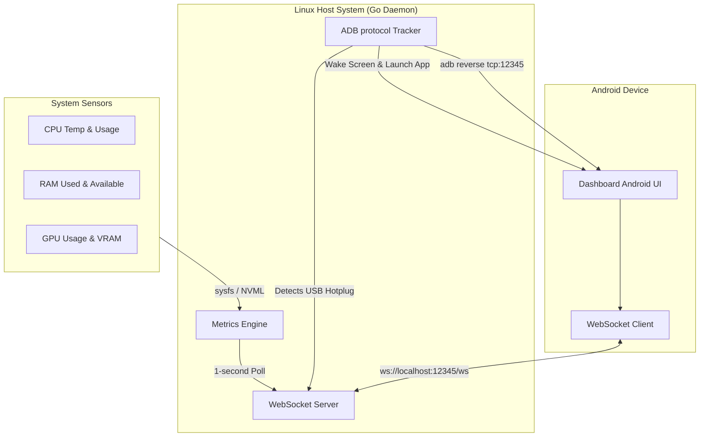

# Architecture & API Reference

This guide details the internal system architecture, communications flow, API schema, and systemd integration model of the **PC Dashboard Server** daemon.

## System Architecture & Flow



---

## WebSocket API Schema

The daemon pushes structured telemetry payloads every second to all connected WebSocket clients on the `/ws` endpoint:

```json
{
  "type": "telemetry",
  "timestamp": 1716213825,
  "data": {
    "cpu": {
      "usage_percent": 18.7,
      "temp_celsius": 49.0,
      "freq_mhz": 3200.0,
      "power_watts": 45.2
    },
    "gpu": {
      "usage_percent": 41.0,
      "temp_celsius": 58.0,
      "vram_used_bytes": 3121561600,
      "vram_total_bytes": 8589934592,
      "freq_mhz": 1200.0,
      "power_watts": 125.5,
      "vram_temp_celsius": 62.5,
      "vram_freq_mhz": 1600.0
    },
    "ram": {
      "used_bytes": 14212567040,
      "total_bytes": 34359738368,
      "percentage": 41.3
    },
    "swap": {
      "used_bytes": 524288000,
      "total_bytes": 2147483648,
      "percentage": 24.4
    },
    "zram": {
      "orig_data_size_bytes": 1073741824,
      "compr_data_size_bytes": 377487360,
      "mem_used_total_bytes": 419430400,
      "total_bytes": 4294967296,
      "compression_ratio": 2.84
    }
  }
}
```

---

## Run as a Linux User Daemon (Systemd)

To run the server continuously in the background within your desktop user space (safe and recommended as it requires zero root privileges), configure it as a **Systemd User Service**.

### 1. Install the Service File

First, ensure the user-level systemd configuration directory exists, and then create the service configuration file at `~/.config/systemd/user/pc-dashboard.service`:

```bash
# Create the user systemd directory if it does not exist
mkdir -p ~/.config/systemd/user

# Write the service definition file
cat << 'EOF' > ~/.config/systemd/user/pc-dashboard.service
[Unit]
Description=PC Dashboard Server Daemon
After=network.target adb.service
Documentation=https://github.com/noosxe/pc-dashboard-server

[Service]
Type=simple
ExecStart=%h/go/bin/pc-dashboard-server start
Restart=on-failure
RestartSec=3s

[Install]
WantedBy=default.target
EOF
```

> [!NOTE]
> The default configuration assumes the binary was installed via `go install` (placed in `~/go/bin/`). If you built from source or moved the binary elsewhere, modify the `ExecStart` line to point to your absolute binary path (e.g., `/usr/local/bin/pc-dashboard-server`).

### 2. Enable User Lingering (Recommended)

By default, user-level systemd services only start when the user logs in and are terminated when the user logs out. To allow the service to start automatically on system boot and continue running in the background when you are logged out, enable user lingering:

```bash
loginctl enable-linger $USER
```

### 3. Control the Daemon

Manage the service using `systemctl` with the `--user` flag:

```bash
# Reload the systemd manager configuration
systemctl --user daemon-reload

# Enable the service to start automatically on boot / login
systemctl --user enable pc-dashboard.service

# Start the service immediately
systemctl --user start pc-dashboard.service

# Check the active status of the service
systemctl --user status pc-dashboard.service

# View real-time daemon logs
journalctl --user -u pc-dashboard.service -f -n 100
```
