# Design Document: System Libraries & Toolchain Selection

This document outlines the selected tools, libraries, and protocols to implement the **PC Dashboard Server** daemon in Go. The libraries are chosen to satisfy lightweight operations, security boundaries, performance efficiency, and cross-compilation safety.

---

## 1. Programming Language & Core Platform

*   **Language**: Go (Golang) `1.26.3`
*   **Rationale**: Go is ideal for system daemons. It compiles into a single, dependency-free static binary that executes with extremely low memory overhead (~10–15 MB). Go has powerful concurrency primitives (`goroutines`, `channels`, `select`) which allow managing independent monitoring loops, ADB tracking connections, and WebSocket clients concurrently without thread exhaustion.

---

## 2. Component Toolchain & Dependency Matrix

| Component Area | Selected Tool / Library | Role & Rationale | CGO Dependency | Security / Safety Profile |
| :--- | :--- | :--- | :--- | :--- |
| **CLI & Command Routing** | `github.com/spf13/cobra` | Base command and subcommand routing (e.g. `start`, `config`). Already integrated. | None (Pure Go) | **Safe**: No command injection vulnerabilities; handles flag parsing through rigid type-safe interfaces. |
| **Host System Metrics** | `github.com/shirou/gopsutil/v4` | High-level tracking of host CPU ticks and Virtual Memory (RAM) statistics. | None (Pure Go) | **Safe**: Standard library-backed `/proc` and `/sys` parser. Does not load unverified binary libraries. |
| **Linux Temperature Sensors** | Native `/sys` Reader (`os`, `io`) | Native sysfs node parser (`/sys/class/thermal` and `/sys/class/hwmon`). | None (Pure Go) | **Safe**: Handled via secure read-only standard file APIs. Avoids external dependencies entirely. |
| **NVIDIA GPU & VRAM** | `github.com/NVIDIA/go-nvml` | Official Go bindings for NVIDIA Management Library (NVML) to get temp, utilization, and memory metrics. | **Yes** (Requires `libnvidia-ml.so` at runtime) | **Safe**: Communicates through official NVIDIA driver libraries. Includes safe query bindings. |
| **AMD/Intel GPU & VRAM** | Native `/sys` Reader (`os`, `io`) | Reads GPU busy percent and VRAM metrics from open-source Linux kernel interfaces. | None (Pure Go) | **Safe**: Simple, direct filesystem access; immune to binary exploitation. |
| **ADB USB Protocol Interface** | Direct TCP Protocol Wrapper / `github.com/zach-klippenstein/goadb` | Establishes a TCP streaming socket with local ADB server (`127.0.0.1:5037`) for tracking and reverse tunneling. | None (Pure Go) | **Highly Safe**: By interacting directly over standard TCP rather than executing external shell commands, it completely eliminates shell injection vectors. |
| **WebSocket Networking** | `github.com/gorilla/websocket` or `nhooyr.io/websocket` | Standard Go framework for high-throughput, asynchronous WebSocket routing. | None (Pure Go) | **Highly Safe**: Complies fully with RFC 6455. Restricts listener strictly to the local loopback `127.0.0.1`. |
| **Configuration Management** | `github.com/knadh/koanf/v2` | Lightweight, extensible configuration engine supporting YAML configs, environment variables, and CLI flags. | None (Pure Go) | **Safe**: Minimal, modern codebase. Parses strict schemas without arbitrary code execution vectors. |
| **D-Bus & Media (MPRIS)** | `github.com/godbus/dbus/v5` | Low-overhead connection to D-Bus Session Bus to query and control MPRIS media players. | None (Pure Go) | **Safe**: Native Go implementation of D-Bus protocol. Avoids binary/CLI dependencies and execution. |
| **D-Bus & Power Profiles** | `github.com/godbus/dbus/v5` | Low-overhead connection to D-Bus System Bus to query and control system power profiles. | None (Pure Go) | **Safe**: Native Go implementation of D-Bus protocol. Avoids spawning system shell processes. |

---

## 3. Library Deep Dives & Architectural Rationales

### 3.1. Telemetry Reader: `gopsutil` vs Custom Parsing
*   **Decision**: Use `gopsutil/v4` for general OS metrics (CPU usage ticks, total/available memory).
*   **Rationale**: `gopsutil` handles OS differences dynamically and operates with zero CGO dependencies on Linux (it reads directly from `/proc/stat` and `/proc/meminfo` using Go standard library).
*   **Fallback Strategy**: To retrieve CPU/GPU temperatures, the daemon falls back to standard sysfs pathways. Caching directory descriptors prevents high-frequency directory walking.

### 3.2. ADB Communication: Pure Socket Protocol vs `adb` CLI Binary Execution
*   **Decision**: Use pure TCP sockets to connect directly to the background ADB daemon on port `5037`.
*   **Rationale**: 
    1.  **Safety**: Invoking external binaries like `exec.Command("adb", "devices")` introduces risks of argument injection and binary search path manipulation. Socket interfaces eliminate these issues.
    2.  **Performance**: Streaming hotplug notifications via `host:track-devices` over a persistent TCP socket has near-zero overhead. Spawning new system processes to run `adb` commands every second wastes CPU cycles.
*   **Mechanism**:
    *   Open TCP connection to `127.0.0.1:5037`.
    *   Write formatted frame headers, such as:
        *   `0012host:track-devices` (for hotplug tracking).
        *   `001Fhost:transport:<serial>` followed by `0015reverse:forward:tcp:12345;tcp:12345` (for reverse port configuration).

### 3.3. WebSocket Engine: `gorilla/websocket`
*   **Decision**: Standardize on `github.com/gorilla/websocket` for real-time messaging.
*   **Rationale**: It is the most robust, battle-tested Go WebSocket library. It includes mature mechanisms for:
    1.  Handling connection loss through Keepalive Pings/Pongs.
    2.  Framing telemetry data as compact, serialized UTF-8 JSON.
    3.  Throttling and writing concurrency guards (safe concurrent connection writes).

### 3.4. Configuration Engine: `koanf`
*   **Decision**: Use `github.com/knadh/koanf/v2` as the unified config parsing and state management layer.
*   **Rationale**:
    1.  **Extreme Efficiency**: `koanf` is significantly lighter and faster than alternatives like `viper`, using an extremely clean, modular design.
    2.  **Extensible Providers & Parsers**: Easily merges configurations from multiple layers (defaults -> YAML/JSON file -> Env Variables -> CLI flags) using a structured abstraction.
    3.  **Strict Typings**: Safe configuration mapping using `koanf.Unmarshal` into strongly typed Go configuration structs, preventing runtime type coercion errors.

### 3.5. D-Bus and MPRIS Interface: `godbus` vs Command-Line Parsing
*   **Decision**: Use `github.com/godbus/dbus/v5` to communicate directly with the desktop D-Bus Session Bus.
*   **Rationale**:
    1.  **CGO-Free & High Portability**: Unlike libdbus bindings, `godbus` is written in 100% pure Go. It connects directly to D-Bus unix domain sockets (`/run/user/...` or via the `DBUS_SESSION_BUS_ADDRESS` environment variable) using standard TCP/Unix socket primitives. This retains absolute static binary capability without needing dynamic library linkers.
    2.  **Safety**: Interacting directly over standard D-Bus socket connections completely avoids spawning shell helper binaries like `playerctl`, `dbus-send`, or `gdbus`. This eliminates any possibilities of arguments escaping or shell injections.
    3.  **Low-Overhead Event Loops**: `godbus` provides native signal binding. Instead of having to spin up new OS processes to poll player states periodically, the daemon registers event listeners to receive lightweight, asynchronously pushed D-Bus change frames. This maintains a sub-millisecond response latency with near-zero CPU and memory usage.

---

## 4. Modularity & Swappable Interface Design

To enable local mocking, unit testing, and simulation, all hardware telemetry gathering and ADB connectivity components are abstracted behind strict Go interfaces. Concrete implementations can be seamlessly swapped at runtime based on configuration settings or CLI execution flags.

```mermaid
graph TD
    DaemonCore[Daemon Engine] -->|uses| MetricsReader[MetricsReader Interface]
    DaemonCore -->|uses| ADBClient[ADBClient Interface]
    DaemonCore -->|uses| MPRISManager[MPRISManager Interface]
    DaemonCore -->|uses| NotificationManager[NotificationManager Interface]
    DaemonCore -->|uses| LockManager[LockManager Interface]
    DaemonCore -->|uses| PowerProfilesManager[PowerProfilesManager Interface]
    
    MetricsReader -.->|Implementation| RealMetrics[HostMetricsReader <br>gopsutil + sysfs]
    MetricsReader -.->|Implementation| MockMetrics[MockMetricsReader <br>Simulated Wave Data]
    
    ADBClient -.->|Implementation| SocketADB[SocketADBClient <br>Real TCP port 5037]
    ADBClient -.->|Implementation| MockADB[MockADBClient <br>Simulated physical triggers]

    MPRISManager -.->|Implementation| DbusMPRIS[DbusMPRISManager <br>Pure Go D-Bus session bus]
    MPRISManager -.->|Implementation| MockMPRIS[MockMPRISManager <br>Simulated player states]

    NotificationManager -.->|Implementation| DbusNotifications[DbusNotificationManager <br>Pure Go D-Bus session bus]
    NotificationManager -.->|Implementation| MockNotifications[MockNotificationManager <br>Simulated notification popups]

    LockManager -.->|Implementation| DbusLock[DbusLockManager <br>Pure Go D-Bus session/system buses]
    LockManager -.->|Implementation| MockLock[MockLockManager <br>Simulated session lock events]

    PowerProfilesManager -.->|Implementation| DbusPower[DbusPowerProfilesManager <br>Pure Go D-Bus system bus]
    PowerProfilesManager -.->|Implementation| MockPower[MockPowerProfilesManager <br>Simulated power profiles]
```



### 4.1. Metrics Collection Interface (`MetricsReader`)
The metrics gathering routine communicates exclusively through this interface:

```go
package metrics

// CPUMetrics holds processor performance telemetry.
type CPUMetrics struct {
    UsagePercent float64 `json:"usage_percent"`
    TempCelsius  float64 `json:"temp_celsius"`
}

// RAMMetrics holds physical memory telemetry.
type RAMMetrics struct {
    UsedBytes  uint64  `json:"used_bytes"`
    TotalBytes uint64  `json:"total_bytes"`
    Percentage float64 `json:"percentage"`
}

// GPUMetrics holds graphics processor telemetry.
type GPUMetrics struct {
    UsagePercent   float64 `json:"usage_percent"`
    TempCelsius    float64 `json:"temp_celsius"`
    VramUsedBytes  uint64  `json:"vram_used_bytes"`
    VramTotalBytes uint64  `json:"vram_total_bytes"`
}

// SystemMetrics combines all gathered hardware statistics.
type SystemMetrics struct {
    CPU CPUMetrics `json:"cpu"`
    RAM RAMMetrics `json:"ram"`
    GPU GPUMetrics `json:"gpu"`
}

// MetricsReader defines the contract for reading system performance telemetry.
type MetricsReader interface {
    // ReadCPU returns overall CPU usage percentages and core package temperatures.
    ReadCPU() (CPUMetrics, error)
    
    // ReadRAM returns physical host RAM stats (used, total, percentage).
    ReadRAM() (RAMMetrics, error)
    
    // ReadGPU returns graphics processor core usage, temperature, and VRAM utilization.
    ReadGPU() (GPUMetrics, error)
}
```

*   **Implementations**:
    1.  `HostMetricsReader`: Production reader querying `gopsutil` for CPU/RAM, and dynamically routing GPU checks to NVML or open sysfs hooks.
    2.  `MockMetricsReader`: Telemetry emulator generating smooth mock waves (sine/cosine curves) for CPU, GPU utilization, and temperatures without requiring hardware sensors.

### 4.2. ADB Transport Interface (`ADBClient`)
The USB autodiscovery engine uses this interface to communicate with the Android companion device:

```go
package adb

import "context"

// DeviceState represents the current state of a physical USB target device.
type DeviceState string

const (
    StateOnline  DeviceState = "online"
    StateOffline DeviceState = "offline"
)

// DeviceEvent represents a hotplug modification tracked by ADB.
type DeviceEvent struct {
    Serial string
    State  DeviceState
}

// ADBClient defines the contract for ADB command and connection lifecycle routines.
type ADBClient interface {
    // TrackDevices streams hotplug device connection changes over an event channel.
    TrackDevices(ctx context.Context) (<-chan DeviceEvent, error)
    
    // ReversePort configures port-redirection mapping from target device back to the host PC.
    ReversePort(ctx context.Context, serial string, localPort, devicePort int) error
    
    // LaunchApp executes shell sequences to launch the companion app activity on the target.
    LaunchApp(ctx context.Context, serial string, pkg, activity string) error
    
    // WakeDevice wakes up the target screen from low-power sleep states.
    WakeDevice(ctx context.Context, serial string) error

    // CloseApp stops/kills the target companion application on the client.
    CloseApp(ctx context.Context, serial string, pkg string) error
}
```

*   **Implementations**:
    1.  `TCPADBClient`: Production client communicating directly over TCP socket streams with the background ADB daemon on port `5037`.
    2.  `MockADBClient`: Simulation client that triggers artificial `device online/offline` events, allowing full testing of the websocket handshake loops inside devcontainers.
    
> [!NOTE]
> **App Control Bypass**: If `--no-app-control` is specified (represented by `adb.no_app_control` configuration option), the daemon will bypass calls to `WakeDevice`, `LaunchApp`, and `CloseApp`, while continuing to configure the reverse port tunnel using `ReversePort`.


### 4.3. Media & MPRIS Controller Interface (`MPRISManager`)
The media playback monitoring and remote control engine communicates exclusively through this interface:

```go
package mpris

import "context"

// PlaybackStatus represents the state of a player.
type PlaybackStatus string

const (
    StatusPlaying PlaybackStatus = "Playing"
    StatusPaused  PlaybackStatus = "Paused"
    StatusStopped PlaybackStatus = "Stopped"
)

// PlayerMetadata represents the track currently playing.
type PlayerMetadata struct {
    TrackID     string   `json:"track_id"`
    Title       string   `json:"title"`
    Artist      []string `json:"artist"`
    Album       string   `json:"album"`
    ArtURL      string   `json:"art_url"`
    LengthMicro int64    `json:"length_microseconds"` // length in microseconds
}

// PlayerState represents the complete state of a media player.
type PlayerState struct {
    PlayerName     string         `json:"player_name"`     // D-Bus service suffix (e.g. "firefox.instance_1_63")
    Identity       string         `json:"identity"`        // User-friendly name (e.g. "Mozilla zen")
    DesktopEntry   string         `json:"desktop_entry"`   // Desktop entry name (e.g. "zen")
    PlaybackStatus PlaybackStatus `json:"playback_status"`
    Volume         float64        `json:"volume"`             // 0.0 to 1.0
    PositionMicro  int64          `json:"position_microseconds"` // current playback position
    Metadata       PlayerMetadata `json:"metadata"`
}

// MediaEvent represents a change in the active players or their playback states.
type MediaEvent struct {
    ActivePlayers []PlayerState `json:"active_players"`
}

// MPRISManager defines the contract for monitoring and controlling MPRIS players.
type MPRISManager interface {
    // Start begins monitoring DBus for MPRIS players and pushes state updates.
    Start(ctx context.Context) (<-chan MediaEvent, error)
    
    // SendCommand issues a control command to a specific active player.
    SendCommand(ctx context.Context, playerName string, command string, args map[string]interface{}) error
}
```

*   **Implementations**:
    1.  `DbusMPRISManager`: Production client communicating directly over D-Bus Session sockets using `godbus`.
        - **Tiered Name Resolution Engine**: To resolve user-friendly names (e.g. `"Mozilla zen"`) instead of raw service suffixes (e.g. `"firefox.instance_1_63"`), the production manager implements a multi-tier resolution process:
          - *Tier 1: MPRIS Identity Property*: Fetches `org.mpris.MediaPlayer2.Identity` directly from the D-Bus object path `/org/mpris/MediaPlayer2`.
          - *Tier 2: MPRIS DesktopEntry Property*: Fetches `org.mpris.MediaPlayer2.DesktopEntry` (e.g. `"zen"`), then scans standard XDG applications directories (`$XDG_DATA_DIRS/applications/` and `~/.local/share/applications/`) to parse `[desktopEntry].desktop` and read its user-facing `Name=` field.
          - *Tier 3: PID Executable Resolution*: Queries D-Bus connection Unix Process ID (`org.freedesktop.DBus.GetConnectionUnixProcessID`), reads `/proc/<pid>/exe` to extract the binary basename (e.g. `"zen"`), and uses it to find/parse corresponding `.desktop` entries.
    2.  `MockMPRISManager`: Simulation client that generates fluctuating player progress and rotates song metadata for local emulation.

### 4.4. Notification Manager Interface (`NotificationManager`)
The notification routing and triggering engine communicates exclusively through this interface:

```go
package notifications

import "context"

// NotificationEvent represents a notification caught on the D-Bus bus.
type NotificationEvent struct {
	ID            uint32                 `json:"id"`
	AppName       string                 `json:"app_name"`
	ReplacesID    uint32                 `json:"replaces_id"`
	AppIcon       string                 `json:"app_icon"`
	Summary       string                 `json:"summary"`
	Body          string                 `json:"body"`
	Actions       []string               `json:"actions"`
	Hints         map[string]interface{} `json:"hints"`
	ExpireTimeout int32                  `json:"expire_timeout"`
}

// NotificationRequest represents a request to trigger a notification via D-Bus.
type NotificationRequest struct {
	AppName       string                 `json:"app_name"`
	ReplacesID    uint32                 `json:"replaces_id"`
	AppIcon       string                 `json:"app_icon"`
	Summary       string                 `json:"summary"`
	Body          string                 `json:"body"`
	Actions       []string               `json:"actions"`
	Hints         map[string]interface{} `json:"hints"`
	ExpireTimeout int32                  `json:"expire_timeout"`
}

// NotificationManager defines the contract for monitoring and triggering notifications.
type NotificationManager interface {
	// Start begins monitoring D-Bus for notifications and pushes caught notifications.
	Start(ctx context.Context) (<-chan NotificationEvent, error)

	// SendNotification triggers a notification on D-Bus.
	SendNotification(ctx context.Context, req NotificationRequest) (uint32, error)

	// CloseNotification dismisses an active notification on the host system.
	CloseNotification(ctx context.Context, id uint32) error

	// InvokeAction invokes a designated action button/behavior on the target notification.
	InvokeAction(ctx context.Context, id uint32, actionKey string) error
}
```

*   **Implementations**:
	1.  `DbusNotificationManager`: Production client communicating directly over D-Bus Session sockets using `godbus`'s `BecomeMonitor` for interception, correlating returned notification IDs, emitting `ActionInvoked` signals for actions, and calling `CloseNotification` methods for dismissal.
	2.  `MockNotificationManager`: Emulation client that triggers randomized simulated notification events with incrementing IDs, logs mock actions, and logs mock dismissals.

### 4.5. Session Lock Interface (`LockManager`)
The user session lock status tracking engine communicates exclusively through this interface:

```go
package lock

import "context"

// SessionLockEvent represents a change in the user session lock status.
type SessionLockEvent struct {
	Locked bool `json:"locked"`
}

// LockManager defines the contract for monitoring session lock/unlock events.
type LockManager interface {
	// Start begins monitoring the session lock status and pushes state updates.
	Start(ctx context.Context) (<-chan SessionLockEvent, error)
}
```

*   **Implementations**:
	1.  `DbusLockManager`: Production client monitoring systemd session lock/unlock events via `dbus.ConnectSystemBus()` and screensaver activation changes via `dbus.ConnectSessionBus()`, piping them to a single unified channel.
	2.  `MockLockManager`: Emulation client that simulates lock and unlock status toggles on a periodic ticker to enable offline testing.

### 4.6. Power Profiles Interface (`PowerProfilesManager`)
The system power profile tracking and switching engine communicates exclusively through this interface:

```go
package power

import "context"

// PowerProfile holds the name of a power profile.
type PowerProfile struct {
	Profile string `json:"profile"`
}

// PowerProfileState holds the current power profile and available profiles.
type PowerProfileState struct {
	ActiveProfile     string         `json:"active_profile"`
	AvailableProfiles []PowerProfile `json:"available_profiles"`
}

// PowerProfilesManager defines the contract for querying and controlling power profiles.
type PowerProfilesManager interface {
	// Start begins monitoring the power profiles and pushes state updates.
	Start(ctx context.Context) (<-chan PowerProfileState, error)

	// SetPowerProfile writes a new active power profile name to D-Bus.
	SetPowerProfile(ctx context.Context, profile string) error
}
```

*   **Implementations**:
	1.  `DbusPowerProfilesManager`: Production manager communicating directly over the D-Bus System Bus with `net.hadess.PowerProfiles` using `godbus`.
	2.  `MockPowerProfilesManager`: Emulation client that simulates supported profiles (`balanced`, `power-saver`, `performance`) and maintains profile change state in-memory to enable containerized testing.

### 4.7. Application Package & Module Layout

To enforce strict boundary segregation, testability, and swappability, the Go daemon codebase is organized into isolated packages with specific, single-responsibility boundaries:

```
pc-dashboard-server/
├── cmd/                          # Command-Line Interfaces (Cobra-based)
│   ├── root.go                   # Root Command router
│   ├── start.go                  # Bootstrap command: loads configuration and boots modules
│   └── trigger.go                # Command trigger client: relays events to UDS
├── pkg/
│   ├── config/                   # Configuration management module
│   │   ├── config.go             # Strongly-typed configuration structures
│   │   └── loader.go             # Koanf-based configuration load logic
│   ├── metrics/                  # Hardware telemetry gathering module
│   │   ├── metrics.go            # MetricsReader interface & telemetry struct models
│   │   ├── host_reader.go        # Production MetricsReader (gopsutil & sysfs)
│   │   └── mock_reader.go        # Simulated metrics wave generator (sine-wave telemetry)
│   ├── adb/                      # USB/ADB Autodiscovery and communication module
│   │   ├── client.go             # ADBClient interface & connection structures
│   │   ├── socket_client.go      # Production ADBClient (direct socket TCP:5037)
│   │   └── mock_client.go        # Simulated ADB physical connection generator
│   ├── mpris/                    # Media & MPRIS player monitoring module
│   │   ├── mpris.go              # MPRISManager interface & state structures
│   │   ├── dbus_manager.go       # Production MPRISManager (native D-Bus:session)
│   │   └── mock_manager.go       # Simulated media player state generator
│   ├── notifications/            # Desktop notification synchronization module
│   │   ├── notifications.go      # NotificationManager interface & event models
│   │   ├── dbus_manager.go       # Production NotificationManager (native D-Bus:session)
│   │   └── mock_manager.go       # Simulated notification event generator
│   ├── lock/                     # Session Lock & Screensaver monitoring module
│   │   ├── lock.go               # LockManager interface & event models
│   │   ├── dbus_manager.go       # Production LockManager (Session & System D-Bus)
│   │   └── mock_manager.go       # Simulated session lock event generator
│   ├── power/                    # Power profiles monitoring & control module
│   │   ├── power.go              # PowerProfilesManager interface & event models
│   │   ├── dbus_manager.go       # Production PowerProfilesManager (System D-Bus)
│   │   └── mock_manager.go       # Simulated power profiles event generator
│   ├── websocket/                # Multi-client local websocket communication module
│   │   ├── server.go             # Gorilla-websocket host bind:127.0.0.1:12345
│   │   └── connection_pool.go    # Thread-safe concurrent writing and ping/pong keepalive
│   └── daemon/                   # Daemon orchestrator and runtime coordinator module
│       ├── engine.go             # Core daemon loop coupling ADB, Metrics, and WebSockets
│       └── command_listener.go   # Unix Domain Socket local command trigger server
└── main.go                       # Minimal application entry point
```

#### Module Interactions & Orchestration

1. **Bootstrap Phase**: The `cmd/start.go` module loads configuration variables via `pkg/config`. It checks CLI flags (e.g. `--emulate-metrics`, `--mock-adb`) or YAML values to instantiate the requested implementations of `MetricsReader`, `ADBClient`, `MPRISManager`, `NotificationManager`, `LockManager`, and `PowerProfilesManager`.
2. **Injection Phase**: The instantiated interfaces are injected directly into the `pkg/daemon` Orchestrator module.
3. **Tracking Phase**: The `pkg/daemon` engine starts the device tracking routine via the injected `ADBClient`. On detecting an `online` event, it performs the bootstrap (wake device, launch package `com.noosxe.pc_dashboard`, reverse port tunnel).
4. **Broadcasting Phase**: The `pkg/daemon` engine instantiates the loopback WebSocket server (`pkg/websocket`). It spins up a ticker thread that polls metrics via the injected `MetricsReader` every second. Concurrently, it listens on the `MPRISManager`, `NotificationManager`, `LockManager`, and `PowerProfilesManager` event channels, pushing `media_state`, `notification_event`, `session_lock`, and `power_profile_state` updates to the WebSocket broadcaster as they arrive.
   - **Session Lock State Caching**: To ensure newly connected clients are immediately aware of the host machine's lock state, the orchestration engine caches the last received `session_lock` status in memory. When a client establishes a new WebSocket connection, the engine is notified via an `onConnect` callback and immediately streams the cached session lock state to that client.
   - **Power Profile Caching**: Similarly, the engine caches the last received `power_profile_state` to immediately push the current system profile and list of available profiles to clients as soon as they connect.
5. **Command Ingestion Phase**: WebSocket clients send `notification_command`, `media_command`, or `power_profile_command` JSON frames to `/ws`. The WebSocket pool parses these frames and forwards them via the orchestration engine to `NotificationManager`, `MPRISManager`, or `PowerProfilesManager` to execute actions or trigger properties writes on the host system.
6. **Local Command Socket Triggering**: 
   - When the daemon starts, the `pkg/daemon` engine starts the `command_listener` goroutine which binds to a local Unix Domain Socket (default `$XDG_RUNTIME_DIR/pc-dashboard-server.sock`).
   - The CLI `cmd/trigger.go` command runs as a separate process invocation. It validates the user's requested trigger (lock, unlock, notification, power profile, etc.), constructs a structured `UDSRequest`, dials the Unix socket, and transmits the payload.
   - The `command_listener` reads this request, validates the type/schema, retrieves the current connection pool status to report active WebSocket client count, broadcasts the payload to all active WebSocket clients, and writes back a `UDSResponse` containing success state and routed client count.


---

## 5. Security Integration (TODO(security))

*   **Secure Dependency Verification**: Every library will be checked to confirm it contains zero known CVEs (Common Vulnerabilities and Exposures) prior to final inclusion.
*   **Local TCP Boundary**:
    WebSocket routes are restricted to the local loopback (`127.0.0.1`). Physical access via a USB connection (secured via ADB client authentication keys on the host machine) is the single path of access to the WebSocket port, keeping the surface area completely isolated.
*   **Unix Domain Socket Security Bounds**:
    The command trigger socket binds inside the user-owned runtime directory (default `$XDG_RUNTIME_DIR`), which restricts filesystem access to the current active user (`0700` parent permissions). The socket file itself is created with owner-only access. The daemon validates each incoming event type and schema before broadcasting, blocking un-sanitized or malformed messages from traversing the local WebSocket pool.

---

## 6. Structured Logging Architecture

The daemon utilizes Go's standard `log/slog` library for structured and level-controlled logging. This design achieves robust observability and easy integration with systemd journaling and machine-based log aggregators.

### 6.1. Logger Bootstrapping and Output Handlers
At startup, the root structured logger is initialized based on the configuration context:
- **Output Target**: Writes strictly to `os.Stderr`, which is captured automatically by `systemd-journald` when executed as a service.
- **Dynamic Format Selection**:
  - **Text Output** (Default/Human-readable): Uses `slog.NewTextHandler` for colorized or readable terminal debugging.
  - **JSON Output**: Uses `slog.NewJSONHandler` for structured log forwarding.
- **Log Level**: Controlled dynamically via `--log-level` (defaulting to `info`) or the `--verbose` / `-v` flag, which forces `debug` log levels.

### 6.2. Subsystem Log Isolation (Per-Module Loggers)
To simplify troubleshooting, every core module is injected with an isolated `*slog.Logger` instance derived from the global root logger, pre-seeded with a `"module"` attribute.

For example:
- **Config**: `logger.With("module", "config")`
- **Metrics**: `logger.With("module", "metrics")`
- **ADB**: `logger.With("module", "adb")`
- **WebSocket**: `logger.With("module", "websocket")`
- **Daemon**: `logger.With("module", "daemon")`

### 6.3. Output Examples

#### Text Format Example
```text
time=2026-05-20T14:52:00Z level=INFO msg="starting websocket server" module=websocket addr=127.0.0.1:12345
time=2026-05-20T14:52:01Z level=DEBUG msg="received ping" module=websocket client=127.0.0.1:54321
time=2026-05-20T14:52:02Z level=WARN msg="ADB device state offline" module=adb serial=usb-dev-123
```

#### JSON Format Example
```json
{"time":"2026-05-20T14:52:00Z","level":"INFO","msg":"starting websocket server","module":"websocket","addr":"127.0.0.1:12345"}
{"time":"2026-05-20T14:52:01Z","level":"DEBUG","msg":"received ping","module":"websocket","client":"127.0.0.1:54321"}
{"time":"2026-05-20T14:52:02Z","level":"WARN","msg":"ADB device state offline","module":"adb","serial":"usb-dev-123"}
```
