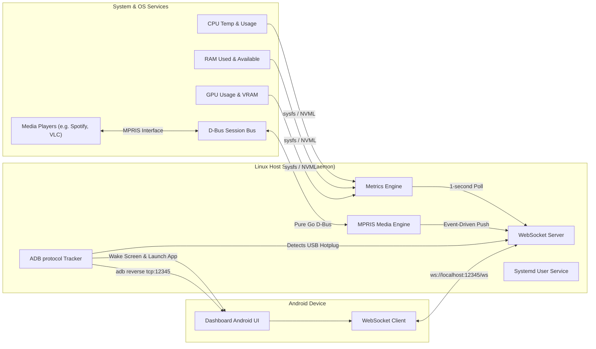

# Technical Specifications: PC Dashboard Server

## 1. Executive Summary & Purpose

The **PC Dashboard Server** is a lightweight, low-overhead system daemon written in Go for Linux host systems. It works in tandem with a companion Android application (expected to be preinstalled on an Android device connected via USB) to turn the mobile device into a dedicated, real-time hardware status monitor and dashboard.

By using physical USB connections instead of local Wi-Fi networks, the system achieves sub-millisecond network latencies, eliminates wireless bandwidth contention, runs securely inside local host loops, and is impervious to external network eavesdropping or packet injection.

---

## 2. High-Level System Architecture



---

## 3. Core Requirements & Component Details

### 3.1. Telemetry Collection Engine
The Telemetry engine gathers host statistics every 1.0 second (hardcoded interval) with low resource overhead. It must run asynchronously and gracefully handle hardware setups that lack dedicated components (e.g. integrated graphics only).

#### A. CPU Statistics
*   **Usage**: The overall CPU utilization percentage across all logical processors. Calculated dynamically by tracking differences in CPU tick times using `github.com/shirou/gopsutil/v4/cpu`.
*   **Cores Usage**: An array of float64 percentages representing individual utilization of each logical processor (CPU core) dynamically computed via differences in CPU tick times using `github.com/shirou/gopsutil/v4/cpu` (with `percpu = true`).
*   **Temperature**: Read from Linux `/sys/` interface.
    *   *Primary Route*: Thermal Zones: `/sys/class/thermal/thermal_zone*/temp` (selecting zones where `type` contains `x86_pkg_temp`, `cpu-thermal`, or `coretemp`).
    *   *Secondary Route*: Hwmon sensors: `/sys/class/hwmon/hwmon*/temp*_input` matching label files containing `Package` or `Core`.
*   **Tmax (Maximum Limit)**: The critical temperature threshold (throttle/shutdown temperature) in Celsius. Read from `/sys/class/hwmon/hwmon*/temp*_crit` matching the active package temperature index (reported in millidegrees Celsius, divided by 1000).
*   **Frequency**: Read in MHz representing active clock speeds across cores.
    *   *Primary Route*: Average scaling frequencies from `/sys/devices/system/cpu/cpu*/cpufreq/scaling_cur_freq` (reported in kHz, divided by 1000).
    *   *Secondary Route*: Fallback to `cpu.Info()` from `github.com/shirou/gopsutil/v4/cpu`, averaging the `Mhz` field from all returned `InfoStat` structs.
*   **Power**: Package-level power consumption in Watts. Calculated by polling `/sys/class/powercap/intel-rapl/intel-rapl:0/energy_uj` (which accumulates microjoules consumed) at standard intervals and computing $\Delta \text{energy\_uj} / (\Delta t \times 1,000,000)$. Supported natively on modern Linux kernels (5.11+) for both Intel and AMD Zen-based processors. Requires specific file access configuration to be read by a non-root daemon user.

#### B. Memory (RAM) Statistics
*   **Total / Used / Available**: Read in bytes.
*   **Utilization**: Total RAM utilization percentage.
*   **Retrieval**: Captured from `/proc/meminfo` via `github.com/shirou/gopsutil/v4/mem`.

#### C. Graphics Processor (GPU, VRAM, Frequency & Power) Statistics
The daemon supports both NVIDIA (proprietary) and open-source AMD/Intel graphics drivers.
*   **NVIDIA GPUs**:
    *   *Primary Method*: Communicate with the local **NVML (NVIDIA Management Library)** using standard Go API bindings (or lightweight CGO-free bindings) to extract core GPU utilization percentage, VRAM utilization, temperature, power usage (`nvmlDeviceGetPowerUsage`), memory clock frequency (`NVML_CLOCK_MEM`), and memory temperature (`NVML_TEMPERATURE_MEM`).
    *   *Fallback Method*: Execute `nvidia-smi` as an external command, querying graphic clock frequency, power draw, and memory clock frequency along with existing metrics:
        ```bash
        nvidia-smi --query-gpu=temperature.gpu,utilization.gpu,memory.used,memory.total,clocks.current.graphics,power.draw,clocks.current.memory --format=csv,noheader,nounits
        ```
        *(Note: Memory temperature is not available via standard `nvidia-smi` query parameters and will default to 0.0).*
*   **AMD & Intel GPUs (sysfs / hwmon)**:
    *   *GPU Power Draw*: Read `/sys/class/drm/card0/device/hwmon/hwmon*/power1_average` (or `power1_input`, reported in microwatts; divided by 1,000,000).
    *   *GPU Busy Percentage*: Read `/sys/class/drm/card0/device/gpu_busy_percent` (or `/sys/class/drm/card0/device/pm_info`).
    *   *VRAM Bytes Used*: Read `/sys/class/drm/card0/device/mem_info_vram_used`.
    *   *VRAM Bytes Total*: Read `/sys/class/drm/card0/device/mem_info_vram_total`.
    *   *GPU Temperature*: Read `/sys/class/drm/card0/device/hwmon/hwmon*/temp1_input`.
    *   *VRAM Temperature*: Probe `/sys/class/drm/card0/device/hwmon/hwmon*/temp*_label` for labels containing `mem`, `vram`, or `junction`, and read the corresponding `temp*_input` (divided by 1000). If no labels match or are available, fall back to `temp2_input` or `temp3_input` on supported cards.
    *   *GPU Frequency*: Query the active graphics clock frequency in MHz in order of preference:
        1.  Intel Active Frequency: `/sys/class/drm/card*/device/gt_act_freq_mhz` (or `/sys/class/drm/card*/gt_act_freq_mhz`).
        2.  AMD DPM System Clock: `/sys/class/drm/card*/device/pp_dpm_sclk` (parsing the active frequency marked with `*`).
        3.  Hwmon Frequency Input: `/sys/class/drm/card*/device/hwmon/hwmon*/freq1_input` (Hz to MHz conversion).
    *   *VRAM Frequency*: Query the active VRAM/memory clock frequency in MHz in order of preference:
        1.  AMD DPM Memory Clock: `/sys/class/drm/card*/device/pp_dpm_mclk` (parsing the active frequency marked with `*`).
        2.  Hwmon Frequency Input: `/sys/class/drm/card*/device/hwmon/hwmon*/freq2_input` (Hz to MHz conversion).
*   **Tmax (Maximum Limit)**: The critical GPU temperature threshold in Celsius. For NVIDIA GPUs, queried via NVML call `nvmlDeviceGetTemperatureThreshold` (slowdown or shutdown threshold). For AMD/Intel GPUs, queried from the critical temperature sysfs nodes: `/sys/class/drm/card0/device/hwmon/hwmon*/temp1_crit` or `temp1_max` (divided by 1000).

#### D. Swap Statistics
*   **Total / Used**: Read in bytes.
*   **Utilization**: Total swap memory utilization percentage.
*   **Retrieval**: Captured using `github.com/shirou/gopsutil/v4/mem` (`SwapMemory()`).

#### E. ZRAM Compressed Memory Statistics
*   **Total Bytes**: Total size of ZRAM disk spaces in bytes.
*   **Original Data Bytes**: Uncompressed size of data stored in ZRAM.
*   **Compressed Data Bytes**: Compressed size of data stored in ZRAM.
*   **Memory Used Total**: Total physical RAM allocated for ZRAM, including allocator fragmentation and metadata overhead.
*   **Compression Ratio**: Calculated ratio of `Original Data Bytes` divided by `Compressed Data Bytes` (when compressed size > 0), rounded to 2 decimal places.
*   **Retrieval**: Discovered by globbing active ZRAM device directories `/sys/block/zram*`. Total bytes are read from `/sys/block/zram<id>/disksize`, and memory stats are parsed from `/sys/block/zram<id>/mm_stat` (containing space-separated values for uncompressed, compressed, and allocator memory totals). Values are accumulated across all active ZRAM devices.

#### G. Peripherals Telemetry
*   **Device Discovery & Identification**: Queries the system D-Bus service `org.freedesktop.UPower` by calling `EnumerateDevices()` on path `/org/freedesktop/UPower` on startup and upon device change signals.
*   **Filtering**: Filters listed power devices by `Type` property:
    *   `Type == 5`: Mouse
    *   `Type == 6`: Keyboard
*   **Battery Charge & Status**: Reads the following properties via D-Bus properties calls:
    *   `Model` (string) and `Vendor` (string): Human-readable device names.
    *   `Percentage` (double, 0-100): Battery charge level.
    *   `State` (uint): Current charging state (e.g. charging, discharging, full).
*   **USB Nominal Polling Rate**:
    *   Locates the sysfs device path corresponding to the keyboard or mouse input device (resolved via udev or input class path).
    *   Queries the USB endpoint descriptor file `bInterval` (e.g. `/sys/bus/usb/devices/*/bInterval`).
    *   Translates the `bInterval` value to a nominal polling rate in Hertz (Hz):
        *   For USB 1.1 / Low Speed: $f = 1000 / \text{bInterval}$ Hz.
        *   For USB 2.0+ / High Speed: $f = 8000 / 2^{\text{bInterval}-1}$ Hz.

#### H. Package Manager Updates indications
*   **PackageKit D-Bus Protocol**:
    *   Monitors the `UpdatesChanged` signal on system D-Bus interface `org.freedesktop.PackageKit` at `/org/freedesktop/PackageKit` to receive updates notifications from the background daemon.
    *   Triggers update counts checks on startup and upon receiving signals by initiating an asynchronous transaction:
        1.  Invokes `CreateTransaction()` on the root interface to obtain a new transaction path.
        2.  Invokes `GetUpdates(1)` (filter `none`) on the transaction path.
        3.  Listens to the `Package(uint32 info, string package_id, string summary)` signals emitted by the transaction. Accumulates the total packages counted. If the `info` flag is `2`, increments the security updates count.
        4.  Closes transaction upon receiving the `Finished` signal.
*   **Local File Fallback (Debian/Ubuntu)**:
    *   Checks `/var/lib/update-notifier/updates-available` at a slower periodic polling rate (e.g. 5 minutes) as a lightweight, unprivileged fallback for apt-based systems.

#### F. Telemetry Support Flags
To allow companion applications to dynamically adapt their interface components (e.g., hiding temperature or power dials if the underlying system lacks the corresponding sensors or permissions), the telemetry payload includes a structured `flags` block. 

These boolean fields indicate capability status:
*   `cpu_usage_supported`: Evaluated by successful gopsutil CPU time query.
*   `cpu_cores_usage_supported`: Evaluated by successful gopsutil per-core CPU time query.
*   `cpu_temp_supported`: Evaluated by detection of package/thermal zones temp sysfs interface.
*   `cpu_freq_supported`: Evaluated by readability of CPU frequency scaling parameters.
*   `cpu_power_supported`: Evaluated by unprivileged read access to RAPL power counters (`energy_uj`).
*   `cpu_temp_tmax_supported`: Evaluated by readability of the critical CPU temperature sysfs interface.
*   `ram_supported`: Evaluated by successful gopsutil virtual memory stats query.
*   `swap_supported`: Evaluated by successful gopsutil swap memory stats query.
*   `zram_supported`: Evaluated by successful discovery of active ZRAM block devices and readability of their sysfs attributes.
*   `gpu_supported`: Evaluated by the detection of a supported graphics driver interface (NVML or Sysfs DRM).
*   `gpu_usage_supported` / `gpu_temp_supported` / `gpu_vram_supported` / `gpu_freq_supported` / `gpu_power_supported` / `gpu_vram_temp_supported` / `gpu_vram_freq_supported`: Evaluated based on the respective reader's ability to locate and query those sensors from the GPU.
*   `gpu_temp_tmax_supported`: Evaluated by capability to retrieve NVML/sysfs critical GPU temperature threshold.
*   `osd_supported`: Evaluated by successful start of key LED polling and PulseAudio connection check.
*   `peripherals_supported`: Evaluated by presence and availability of the UPower system D-Bus interface.
*   `package_updates_supported`: Evaluated by accessibility of the PackageKit system D-Bus service or local update notifier file.

---

### 3.2. USB Discovery & ADB Bootstrapping Protocol
The daemon automatically establishes connection pathways with the Android companion device once connected via USB.

#### A. Device Connection Detection
Rather than executing external `adb devices` calls inside polling loops, the Go daemon utilizes direct TCP sockets over ADB's native client-server protocol.
1.  Connect via TCP socket to the ADB server on `127.0.0.1:5037`.
2.  Transmit the protocol command: `host:track-devices` (preceded by a 4-hex-character length descriptor: `0012host:track-devices`).
3.  The ADB server will stream updates whenever physical USB devices are plugged in, removed, or change state (e.g. `[serial] online`, `[serial] offline`).

#### B. Companion App Bootstrapping
When the target Android device transitions to the `online` state, the daemon initiates a three-step bootstrap:
1.  **Screen Wakeup**: Transmit raw ADB socket packet `shell:input keyevent KEYCODE_WAKEUP` to wake the screen. (Skipped if `--no-app-control` is active).
2.  **App Launch**: Launch the companion application (expected to be preinstalled on the device) by sending:
    ```
    shell:am start -n com.noosxe.pc_dashboard/com.noosxe.pc_dashboard.MainActivity
    ```
    (Skipped if `--no-app-control` is active).
3.  **Port Redirection**: Send a reverse connection request:
    ```
    reverse:forward:tcp:12345;tcp:12345
    ```
    This instructs the Android ADB service to dynamically listen on the mobile device's local port `12345` and securely tunnel all connections to the host PC's local port `12345` over the physical USB bus.

---

### 3.3. WebSocket API & Messaging Schemas
The daemon hosts a WebSocket server binding strictly to the local loopback address `127.0.0.1:12345`. The communication is fully bidirectional.

#### A. Outbound Telemetry Message (Host → Android Client)
Pushed automatically once every second.
*   **Path**: `ws://127.0.0.1:12345/ws`
*   **Schema**:
```json
{
  "type": "telemetry",
  "timestamp": 1716213825,
  "data": {
    "cpu": {
      "usage_percent": 18.7,
      "temp_celsius": 49.0,
      "freq_mhz": 3200.0,
      "power_watts": 45.2,
      "cores_usage_percent": [12.5, 24.1, 8.2, 30.0]
    },
    "gpu": {
      "usage_percent": 41.0,
      "temp_celsius": 58.0,
      "vram_used_bytes": 3121561600,
      "vram_total_bytes": 8589934592,
      "freq_mhz": 1200.0,
      "power_watts": 125.5,
      "vram_temp_celsius": 62.5,
      "vram_freq_mhz": 1600.0
    },
    "ram": {
      "used_bytes": 14212567040,
      "total_bytes": 34359738368,
      "percentage": 41.3
    },
    "swap": {
      "used_bytes": 524288000,
      "total_bytes": 2147483648,
      "percentage": 24.4
    },
    "zram": {
      "orig_data_size_bytes": 1073741824,
      "compr_data_size_bytes": 377487360,
      "mem_used_total_bytes": 419430400,
      "total_bytes": 4294967296,
      "compression_ratio": 2.84
    },
    "flags": {
      "cpu_usage_supported": true,
      "cpu_cores_usage_supported": true,
      "cpu_temp_supported": true,
      "cpu_freq_supported": true,
      "cpu_power_supported": false,
      "ram_supported": true,
      "swap_supported": true,
      "zram_supported": true,
      "gpu_supported": true,
      "gpu_usage_supported": true,
      "gpu_temp_supported": true,
      "gpu_vram_supported": true,
      "gpu_freq_supported": true,
      "gpu_power_supported": true,
      "gpu_vram_temp_supported": false,
      "gpu_vram_freq_supported": true
    }
  }
}
```

#### B. Inbound Control Messages (Android Client → Host)
The companion app can transmit real-time controls back to the daemon:
*   **Ping / Connection Keepalive**:
    ```json
    { "type": "ping" }
    ```
    *Response from Host:* `{"type": "pong"}`
*   **Update Interval Configuration** (for future expansion, currently defaults to 1000ms):
    ```json
    {
      "type": "config",
      "settings": {
        "interval_ms": 1000
      }
    }
    ```
*   **System Action Commands**:
    ```json
    {
      "type": "action",
      "command": "suspend"
    }
    ```

---

### 3.4. Application Configuration Management
The daemon uses **`koanf`** to load and merge configurations from multiple sources into a unified, strongly-typed internal settings structure. 

#### A. Configuration Hierarchy (Precedence)
Settings are resolved in the following order of precedence (highest to lowest):
1.  **Command-Line Flags**: Parsed via `cobra` / `pflag` and bound to `koanf`.
    *   `--verbose`, `-v`: Unconditionally force log level to `debug`.
    *   `--log-level`: Set structured logging level (`debug`, `info`, `warn`, `error`). Default is `info`.
    *   `--log-format`: Set structured log output format (`text`, `json`). Default is `text`.
2.  **Environment Variables**: Prefixed with `PCD_` (e.g., `PCD_SERVER_PORT`, `PCD_DAEMON_LOG_LEVEL`, `PCD_DAEMON_LOG_FORMAT`).
3.  **Local Configuration File**: An optional configuration file loaded dynamically from a predefined location. If no explicit path is passed via command-line flags, the daemon automatically probes for configuration files in the following order:
    *   `~/.config/pc-dashboard/config.yaml` (parsed as YAML)
    *   `~/.config/pc-dashboard/config.yml` (parsed as YAML)
    *   `~/.config/pc-dashboard/config.toml` (parsed as TOML)
    When a file is loaded, the parser is automatically selected based on the file extension (`.yaml` or `.yml` triggers the YAML parser; `.toml` triggers the TOML parser).
4.  **Internal Defaults**: Safe fallback values compiled directly into the binary.

#### B. Configuration Schema (YAML Example)
```yaml
server:
  host: "127.0.0.1"
  port: 12345

daemon:
  update_interval_ms: 1000
  log_level: "info"
  log_format: "text"

adb:
  server_host: "127.0.0.1"
  server_port: 5037
  target_package: "com.noosxe.pc_dashboard"
  target_activity: "com.noosxe.pc_dashboard.MainActivity"
  no_app_control: false
```

#### C. Configuration Schema (TOML Example)
```toml
[server]
host = "127.0.0.1"
port = 12345

[daemon]
update_interval_ms = 1000
log_level = "info"
log_format = "text"

[adb]
server_host = "127.0.0.1"
server_port = 5037
target_package = "com.noosxe.pc_dashboard"
target_activity = "com.noosxe.pc_dashboard.MainActivity"
no_app_control = false
```

---

### 3.5. Operational Specifications (Systemd Daemon)
The PC Dashboard Server operates as a **user-level systemd service** (`systemd --user`). This design ensures that:
*   The application runs inside the desktop user's session space, inheriting authorization settings for local audio/video, display variables, and graphic drivers (NVML).
*   No elevated root privileges are required to run the service, adhering strictly to the principle of least privilege.
*   The service launches automatically upon user login or desktop session activation.

#### Service Installation

First, ensure the user-level systemd configuration directory exists, and then create the service configuration file at `~/.config/systemd/user/pc-dashboard.service`:

```bash
# Create the user systemd directory if it does not exist
mkdir -p ~/.config/systemd/user

# Write the service definition file
cat << 'EOF' > ~/.config/systemd/user/pc-dashboard.service
[Unit]
Description=PC Dashboard Server Daemon
After=network.target adb.service
Documentation=https://github.com/noosxe/pc-dashboard-server

[Service]
Type=simple
ExecStart=/usr/local/bin/pc-dashboard-server start
Restart=on-failure
RestartSec=3s
Environment=LOG_LEVEL=info

[Install]
WantedBy=default.target
EOF
```

> [!NOTE]
> Modify `ExecStart` to match your actual binary location (e.g. `%h/go/bin/pc-dashboard-server` if installed via `go install`).

#### Enable User Lingering (Recommended)

To allow the user systemd manager to start at system boot and remain active when you log out, enable user lingering:

```bash
loginctl enable-linger $USER
```

#### Service Management Commands

Manage the service using `systemctl` with the `--user` flag:

```bash
# Reload user systemd daemon configs
systemctl --user daemon-reload

# Enable the service to start automatically on boot / login
systemctl --user enable pc-dashboard.service

# Start the service immediately
systemctl --user start pc-dashboard.service

# Check the active status of the service
systemctl --user status pc-dashboard.service

# View real-time daemon logs
journalctl --user -u pc-dashboard.service -f -n 100
```

---

### 3.6. Media & Player Control Engine (MPRIS via D-Bus)
The PC Dashboard Server leverages the **D-Bus Session Bus** to dynamically discover, track, and control active media players running in the user desktop space via the **MPRIS (Media Player Remote Interfacing Specification)** standard.

#### A. Player Discovery & Tracking
1.  **D-Bus Session Connection**: The daemon connects to the session D-Bus. Since it runs as a user systemd service, it operates within the logged-in user session, having direct, secure access to the user's D-Bus sockets without requiring elevated root permissions.
2.  **Dynamic Discovery**:
    *   **Listing Players**: The daemon queries the D-Bus interface `org.freedesktop.DBus` by invoking `ListNames` on path `/org/freedesktop/DBus` to find all services matching the prefix `org.mpris.MediaPlayer2.*`.
    *   **Hot-Detection**: Rather than polling, the daemon registers to receive `org.freedesktop.DBus.NameOwnerChanged` signals on `/org/freedesktop/DBus` to immediately catch when media players are spawned (e.g. user opens Spotify) or closed (name owner changes to empty).
3.  **Property & State Monitoring**:
    *   For each active player, the daemon registers to listen for `org.freedesktop.DBus.Properties.PropertiesChanged` signals at object path `/org/mpris/MediaPlayer2` for the interface `org.mpris.MediaPlayer2.Player`.
    *   This ensures that changes in metadata (track title, artist, art URL, length), playback status (`Playing`, `Paused`, `Stopped`), volume level, or playback position are caught via instant, event-driven callbacks.

#### B. Media Player Control API
The companion Android app can issue real-time media player commands back to the daemon over the WebSocket connection. The daemon maps these JSON payloads into standard D-Bus method calls targeting the `org.mpris.MediaPlayer2.Player` interface at `/org/mpris/MediaPlayer2` on the specific player's D-Bus name.
*   **Methods Supported**:
    *   `Next`: Moves to the next track.
    *   `Previous`: Moves to the previous track.
    *   `PlayPause`: Toggles the playback state.
    *   `Play`: Resumes playback.
    *   `Pause`: Pauses playback.
    *   `Stop`: Stops playback.
    *   `Seek` (Argument: `Offset` in microseconds): Relative seek.
    *   `SetPosition` (Arguments: `TrackId` as string, `Position` in microseconds): Absolute seek to track position.
    *   `Volume` (Property write: float double 0.0 to 1.0): Updates player volume.

---

### 3.7. Desktop Notification Sync (D-Bus)
The PC Dashboard Server leverages the **D-Bus Session Bus** to dynamically intercept desktop notifications sent by other applications and forward them to the companion Android app, as well as to publish notifications triggered by the companion app or daemon itself back to the host system.

#### A. Notification Eavesdropping & ID Interception
To catch notifications non-disruptively without interfering with the desktop environment's own notification daemon, the server configures its D-Bus connection as a monitor.
1.  **D-Bus Monitor Mode**: The daemon calls `BecomeMonitor` on the D-Bus interface `org.freedesktop.DBus.Monitoring` at `/org/freedesktop/DBus`.
2.  **Match Rules**: The monitor registration passes rules to listen for both the inbound method calls and outbound method returns of standard notifications:
    ```
    type='method_call',interface='org.freedesktop.Notifications',member='Notify'
    type='method_return'
    ```
3.  **Non-Disruptive Flow**: The session bus routes duplicates of these frames to our monitor connection. The original flows between the client apps and the desktop notification service are completely untouched.
4.  **Payload Extraction**: The daemon intercepts the `Notify` method call arguments: `AppName` (string), `ReplacesID` (uint32), `AppIcon` (string), `Summary` (string), `Body` (string), `Actions` (array of strings), `Hints` (dictionary), and `ExpireTimeout` (int32).
5.  **Asynchronous ID Correlation**: Since system-assigned notification IDs are returned asynchronously in the method reply, the daemon caches the intercepted `Notify` payload in a thread-safe map keyed by the message `Serial()`. When the matching `method_return` is intercepted, its `ReplySerial` header is correlated back to the cached call. The generated notification `ID` (uint32) is extracted from the reply, attached to the notification event payload, and the event is broadcasted over WebSockets. A cache TTL of 5 seconds prevents memory leaks.

#### B. Notification Publishing API
The companion Android app or daemon can trigger new host system toasts by sending a notification request:
1.  **Method Invocation**: The daemon establishes a standard D-Bus connection and invokes `org.freedesktop.Notifications.Notify` targeting the service `org.freedesktop.Notifications` at path `/org/freedesktop/Notifications`.
2.  **Arguments Construction**: The call is constructed with the supplied message fields (`AppName`, `ReplacesID`, `AppIcon`, `Summary`, `Body`, `Actions`, `Hints`, `ExpireTimeout`).
3.  **Result Routing**: The D-Bus broker returns a unique `NotificationID` (uint32) upon success, which is mapped and routed back to the initiating client.

#### C. Notification Actions & Dismissal API
When a user interacts with a notification on the companion Android app, the app sends commands back to the server:
1.  **Invoking Actions**: To invoke an action (e.g. clicking a button), the companion app sends a `notification_action_command` with the `notification_id` and `action_key`. The daemon translates this into an `ActionInvoked` signal emitted on the session D-Bus bus:
    - **Object Path**: `/org/freedesktop/Notifications`
    - **Interface**: `org.freedesktop.Notifications`
    - **Signal Name**: `ActionInvoked`
    - **Parameters**: `id` (uint32), `action_key` (string)
    This broadcasts the action, alerting the original calling application to perform the requested flow (e.g., open a message).
2.  **Notification Dismissal**: When the companion app sends a `notification_dismiss_command` (or immediately following an action invocation to clean up), the daemon calls the D-Bus method `org.freedesktop.Notifications.CloseNotification` with the target `notification_id` as an argument to dismiss the visual toast on the host system desktop.

---

### 3.8. Session Lock & Screensaver Detection (D-Bus)
The PC Dashboard Server leverages both the **D-Bus Session Bus** and the **D-Bus System Bus** to dynamically track user desktop session lock and unlock states. Under this separated behavior, session locks do **not** power down the Android device's screen. Instead, they trigger a distinct dashboard lockscreen state and optional low-power polling throttle.

#### A. Screensaver Status Interception (Session Bus)
To support modern desktop environments (GNOME, KDE, Cinnamon, etc.) that manage screen locks via a user-session screensaver, the daemon connects to the D-Bus Session Bus:
1.  **Match Signal Rules**: The daemon registers match rules to listen for screensaver active/state changes:
    ```
    type='signal',interface='org.freedesktop.ScreenSaver',member='ActiveChanged'
    type='signal',interface='org.gnome.ScreenSaver',member='ActiveChanged'
    ```
2.  **State Parsing**: When an `ActiveChanged(bool)` signal is intercepted, the first body argument represents the screensaver state: `true` indicates the screensaver/lockscreen is active (session locked), and `false` indicates it is inactive (session unlocked).

#### B. User Session State Interception (System Bus via systemd-logind)
To capture physical console session locks managed by systemd, the daemon connects to the D-Bus System Bus:
1.  **Match Signal Rules**: The daemon registers match rules targeting systemd's `logind` session manager:
    ```
    type='signal',sender='org.freedesktop.login1',interface='org.freedesktop.login1.Session',member='Lock'
    type='signal',sender='org.freedesktop.login1',interface='org.freedesktop.login1.Session',member='Unlock'
    ```
2.  **State Parsing**: Intercepting the `Lock` signal designates transition to a locked session. Intercepting the `Unlock` signal designates transition to an unlocked session.

#### C. Unified Pipeline and Deduplication
Since multiple signals (e.g. systemd-logind `Lock` and GNOME Screensaver `ActiveChanged`) might fire simultaneously during a lock event, the daemon pipes both event sources into a unified engine. 
1.  **Deduplication**: The engine tracks the current session lock state. It deduplicates incoming events and only triggers an outbound WebSocket notification if a genuine transition has occurred.
2.  **Graceful Fallback**: If either bus connection or registration fails (e.g., in headless environments, containers, or systems without a system bus), the daemon logs a warning and gracefully operates using only the successful bus, ensuring continuous operation.

#### D. Outbound State and Local Low-Power Polling Throttle
Upon detecting a genuine session lock transition:
1. **Outbound Lock Event**: The daemon broadcasts the `session_lock` WebSocket event carrying a simple binary state (e.g., `{"type": "session_lock", "data": {"locked": true}}`). Upon receiving `"locked": true`, the companion Android application remains awake but transitions its user interface to a **lower-power, custom dashboard lockscreen UI** (retaining design aesthetics while preventing OLED burn-in).
2. **Configurable Low-Power Polling**: While the session is locked, the daemon dynamically throttles the hardware telemetry polling frequency from the standard 1-second rate to a **configurable, reduced frequency** (defaulting to 5.0 seconds, configurable via `daemon.locked_update_interval_ms`). This conserves host CPU cycles, minimizes USB data transfer bandwidth, and reduces Android battery consumption. When the session transitions back to `unlocked`, the standard 1-second high-resolution interval is instantly restored.

---

### 3.9. Display Power Management Signaling (DPMS) Screen Sync
The PC Dashboard Server features a dedicated, independent **DPMS Sync Engine** to coordinate physical display power events between the host workstation and the connected Android companion device. When the host's physical displays go completely blank/power off (DPMS Off / Sleep), the Android screen is turned off synchronously. When the host display wakes up (DPMS On), the Android screen is instantly woken up.

#### A. D-Bus Display Power Interception (Desktop Environments)
To support modern desktop environments, the daemon integrates with the system/session D-Bus buses to track native display power changes:
1. **GNOME (Mutter)**: The daemon registers a `PropertiesChanged` signal listener targeting the well-known interface `org.gnome.Mutter.DisplayConfig` on path `/org/gnome/Mutter/DisplayConfig` on the D-Bus Session Bus. It extracts the `PowerSaveMode` property value:
   * `PowerSaveMode == 1` represents DPMS Off (Screen Off).
   * `PowerSaveMode == 0` represents DPMS On (Screen Normal / On).
2. **KDE (Plasma)**: The daemon registers properties-change listeners targeting `org.freedesktop.PowerManagement` or `org.kde.Solid.PowerManagement` on the D-Bus Session Bus to intercept display power-saving state transitions.

#### B. Independent UNIX Domain Socket Triggering (Minimal Window Managers)
For minimalist window managers and custom Wayland compositors (such as Hyprland, Sway, or i3) that do not publish DPMS property changes over standard D-Bus, the daemon exposes dedicated, independent command trigger pathways over the local Unix Domain Socket (UDS) command trigger:
1. **Dedicated Command Trigger**: The command socket accepts a distinct, standalone `dpms` request payload separate from session management triggers:
   * `{"type": "dpms", "data": {"state": "off"}}`
   * `{"type": "dpms", "data": {"state": "on"}}`
2. **Idle Manager Integration**: Users can easily bind these triggers to their compositor's idle manager or utility scripts (e.g. `hypridle`'s `on-timeout` and `on-resume` directives) by piping the JSON string directly into the local UDS command trigger file (default path resolves to `$XDG_RUNTIME_DIR/pc-dashboard-server.sock`).

#### C. Companion App Physical Screen Control (ADB Core)
Upon receiving or intercepting a display power transition, the daemon issues raw ADB TCP socket commands over local loopback (`127.0.0.1:5037`) to control the physical Android companion device's screen state:
1. **Screen Sleep (DPMS Off)**: The daemon uses raw TCP sockets on port `5037` to issue the non-toggling `shell:input keyevent KEYCODE_SLEEP` (keyevent `223`) command to the target Android companion device. This puts the Android device's screen to sleep to conserve energy and match the host's screen-off state.
2. **Screen Wake (DPMS On)**: The daemon issues the non-toggling `shell:input keyevent KEYCODE_WAKEUP` (keyevent `224`) command to the target Android companion device, waking its screen to resume status visualization immediately.
3. **App-Control Bypass**: If the server configuration has `no_app_control` set to `true`, these automatic wakeup/sleep ADB signals are completely bypassed.

---

### 3.10. Power Profiles Control & Sync (D-Bus)
The PC Dashboard Server leverages the **D-Bus System Bus** to dynamically query available power profiles, track profile changes in real time, and control the active power profile on the host PC via the **`power-profiles-daemon`** standard system service.

#### A. Power Profile Discovery & Tracking
1. **D-Bus System Connection**: The daemon connects to the system bus (`dbus.ConnectSystemBus()`). This connects to the well-known D-Bus service `net.hadess.PowerProfiles` at object path `/net/hadess/PowerProfiles`.
2. **Initial State Fetching**:
   - **Available Profiles**: The daemon reads the `Profiles` property on the `net.hadess.PowerProfiles` interface. The property returns an array of dictionaries (`aa{sv}`). Each dictionary contains a `Profile` key (string) denoting a supported power profile (e.g., `power-saver`, `balanced`, `performance`).
   - **Active Profile**: The daemon reads the `ActiveProfile` property (string) to determine the current system power profile.
3. **Change Monitoring**:
   - The daemon registers to listen for `org.freedesktop.DBus.Properties.PropertiesChanged` signals at object path `/net/hadess/PowerProfiles` for interface `net.hadess.PowerProfiles`.
   - When the signal is received, the daemon checks if the `ActiveProfile` key exists in the changed properties map. If it does, the updated active profile name is extracted and immediately broadcasted to all active WebSocket clients.

#### B. Power Profile Control API
The companion Android app can issue real-time power profile commands back to the daemon over the WebSocket connection.
1. **Profile Validation**: Upon receiving a control request specifying a target profile name, the daemon validates that the requested profile is present in the cached list of available profiles.
2. **Property Write**: If valid, the daemon writes the new profile string to the `ActiveProfile` property on the D-Bus interface `net.hadess.PowerProfiles` at path `/net/hadess/PowerProfiles`.
3. **Bypass on Emulation**: If emulation mode is enabled (`--emulate-metrics`), the daemon simulates the profile transition in memory and broadcasts the updated state without contacting the system D-Bus.

---

### 3.11. Bluetooth Device Monitoring (D-Bus / BlueZ)
The PC Dashboard Server leverages the **D-Bus System Bus** to passively monitor host Bluetooth devices via the **BlueZ** system service (`org.bluez`). It emits real-time connect/disconnect events to the companion Android app and periodically reports battery level and signal strength (RSSI) for all currently connected Bluetooth devices. No active scanning, pairing, or device mutation is performed — the feature is entirely read-only and event-driven.

#### A. Initial Device Discovery
1. **D-Bus System Connection**: The daemon connects to the system bus (`dbus.ConnectSystemBus()`), targeting the well-known BlueZ service `org.bluez`.
2. **Object Manager Bootstrap**: On startup, the daemon calls `org.freedesktop.DBus.ObjectManager.GetManagedObjects` on the `org.bluez` service at the root path `/`. This returns a dictionary of all managed BlueZ objects (adapters and devices). The daemon filters for entries that implement `org.bluez.Device1` and have `Connected == true` to build its initial connected-device state snapshot.
3. **Initial Snapshot Push**: An initial `bluetooth_state` payload with `event_type: "snapshot"` is immediately sent to the WebSocket broadcaster so that all existing clients are synchronized from the first moment.

#### B. Real-Time Event Monitoring
The daemon registers the following D-Bus signal match rules to detect changes without polling:
1. **`InterfacesAdded`** (`org.freedesktop.DBus.ObjectManager` on `org.bluez`): Fired when BlueZ adds a new device object (e.g., a previously unknown device becomes visible). If the added object includes `org.bluez.Device1` and `Connected == true`, the daemon emits a `"connected"` event.
2. **`InterfacesRemoved`** (`org.freedesktop.DBus.ObjectManager` on `org.bluez`): Fired when BlueZ removes a device object (e.g., unpaired device pruned after inactivity). If the removed path corresponds to a known-connected device, the daemon emits a `"disconnected"` event.
3. **`PropertiesChanged`** (`org.freedesktop.DBus.Properties` on `org.bluez.Device1`): This is the primary signal for monitoring connected/disconnected transitions on paired/bonded devices:
   - When the `Connected` property transitions `false → true`: emit `"connected"` event.
   - When the `Connected` property transitions `true → false`: emit `"disconnected"` event.
   - When `RSSI` or battery-related properties change: emit `"updated"` event.

#### C. Periodic Battery Level & RSSI Reporting
For all currently connected Bluetooth devices, the daemon runs a background polling goroutine at a configurable interval (default: **30 seconds**, configurable via `bluetooth.update_interval_s`):
1. **RSSI**: Read `RSSI` (int16, dBm) from the `org.bluez.Device1` interface via `org.freedesktop.DBus.Properties.Get`. This property may not be available for all connected devices (especially bonded devices not in active scan range); if absent, the field is omitted (`null`) from the outbound payload.
2. **Battery Level**: Read `Percentage` (uint8, 0–100) from the `org.bluez.Battery1` interface. This interface is only exposed by devices that implement the Bluetooth Battery Service GATT profile (BAS, UUID `0x180F`) on BlueZ 5.48+. If the interface is absent, the field is omitted (`null`).
3. **Change-Triggered Updates**: If any polled value changes relative to the previously cached state, the daemon emits an `"updated"` event for the affected device. If no values changed, no event is emitted, preventing unnecessary WebSocket traffic.

#### D. WebSocket State Caching
The daemon caches the last `bluetooth_state` payload (the full `connected_devices` list). When a new WebSocket client establishes a connection, the engine immediately pushes the cached Bluetooth state (in addition to the existing `session_lock` and `power_profile_state` caches), ensuring instant synchronization without waiting for the next device event.

#### E. Graceful Degradation
If the BlueZ service is not running (e.g., Bluetooth hardware is absent or `bluetoothd` is stopped), the `Start()` call logs a warning and returns. The daemon continues operating all other subsystems without Bluetooth monitoring — consistent with how GPU metrics handle missing hardware.

---

### 3.12. Local Command Trigger Socket (Unix Domain Socket)
The PC Dashboard Server features a local Unix Domain Socket (UDS) command listener that allows CLI triggers to execute and relay state notifications to active WebSocket clients. This allows simulating and debugging companion application behaviors (e.g. rendering specific telemetry limits, desktop notification popups, session lock screens, or custom JSON formats) without having physical hardware access.

#### A. Socket Lifecycle & Binding
1. **Dynamic Runtime Resolution**: The socket binds to the local system path specified in the configuration. The default path resolves to `$XDG_RUNTIME_DIR/pc-dashboard-server.sock` (XDG-compliant user-specific runtime directory). If `$XDG_RUNTIME_DIR` is empty or missing, it falls back to the system temporary directory: `os.TempDir() + "/pc-dashboard-server.sock"`.
2. **Instance Exclusivity & Cleanup**: 
   - Upon startup, the daemon attempts to dial the existing socket file. If the dial succeeds, it indicates another daemon instance is already active, and the daemon exits with an error.
   - If the dial fails, the socket file is considered stale, deleted via `os.Remove`, and a new UDS listener is bound.
   - On clean engine shutdown, the socket file is unlinked (`os.Remove`) from the filesystem.

#### B. Command Socket Protocol
The client and server communicate using structured JSON over the Unix Domain Socket connection.
1. **Inbound UDS Request**: The client transmits a single UDSRequest:
   - `type` (string): The category of trigger (`session_lock`, `notification_event`, `media_state`, `telemetry`, `raw`).
   - `data` (RawMessage): The corresponding JSON data object.
2. **Outbound UDS Response**: The server processes the request, broadcasts the payload to all active WebSocket clients, and returns a single UDSResponse:
   - `success` (boolean): Whether the event was successfully processed and broadcasted.
   - `client_count` (int): The number of active clients the event was routed to.
   - `error` (string): An optional error description if the operation failed.

---

### 3.13. On-Screen Display (OSD) Events Engine
The PC Dashboard Server features a dedicated, asynchronous OSD Events Engine that tracks system audio adjustments and keyboard indicator locks (Caps/Num/Scroll Lock) and broadcasts real-time transition signals over the WebSocket stream.

#### A. Keyboard Indicator Lock Monitoring (sysfs)
1. **Low-Overhead Sysfs Polling**: The daemon initiates a 200ms background polling ticker. It queries directory paths matching `/sys/class/leds/*::capslock/brightness`, `/sys/class/leds/*::numlock/brightness`, and `/sys/class/leds/*::scrolllock/brightness`.
2. **State Deduplication**: The engine compares the integer brightness value (e.g. `0` for inactive, `1` or non-zero for active) with the last cached state.
3. **Instant Signal Broadcast**: If any transition occurs, the engine constructs a WebSocket `osd_event` payload containing the specific lock type and its current state (`locked`: boolean), allowing the dashboard client to display on-screen status updates (e.g. a Caps Lock overlay) instantaneously.

#### B. System Master Volume & Mute Monitoring (PulseAudio/PipeWire)
1. **Event Subscription**: The daemon spawns a PulseAudio client connection or starts a command-line wrapper subscribing to system sink events: `/usr/bin/pactl subscribe`.
2. **Asynchronous Filtering**: The background reader monitors stdout. On catching lines indicating a `change` event on a `sink`, it immediately executes:
   * `/usr/bin/pactl get-sink-volume @DEFAULT_SINK@`
   * `/usr/bin/pactl get-sink-mute @DEFAULT_SINK@`
3. **Volume Extraction**: The query outputs are parsed to extract the current volume (as a percentage, e.g. `65%`) and mute status (`yes`/`no`).
4. **Transition Broadcasting**: The engine filters out duplicate values and pushes an `osd_event` WebSocket frame when the volume level or mute state changes, enabling the client device to render volume-slider overlays.

---

### 3.14. App Launcher Engine
The PC Dashboard Server features a dedicated App Launcher Engine that allows users to launch pre-configured host applications from their companion Android devices.

#### A. Purpose & Rationale
To ensure the dashboard operates as a useful utility launcher without exposing the host machine to arbitrary Remote Code Execution (RCE) vectors, this module does not support running arbitrary command lines, binary paths, or parameters passed from the client app. Instead, it acts as a key-lookup router against a static whitelist configuration predefined in the server's local configuration.

#### B. Configuration Schema
The app launcher parameters are defined in `config.yaml` as follows:
```yaml
modules:
  app_launcher: true  # Boolean toggle to enable/disable the app launcher module

app_launcher:
  apps:
    steam:
      name: "Steam"
      exec: "/usr/bin/steam"
    discord:
      name: "Discord"
      exec: "/usr/bin/discord"
    browser:
      name: "Web Browser"
      exec: "/usr/bin/xdg-open"
      args: ["https://google.com"]
```

#### C. WebSocket API Protocols
* **Inbound Command Payload (Client → Server)**:
  ```json
  {
    "type": "launch_app_command",
    "app_key": "steam"
  }
  ```
* **Outbound Response Payload (Server → Client)**:
  Sent to the invoking client immediately upon attempting process execution.
  ```json
  {
    "type": "launch_app_response",
    "status": "success",
    "app_key": "steam"
  }
  ```
  Or on failure:
  ```json
  {
    "type": "launch_app_response",
    "status": "error",
    "app_key": "steam",
    "error": "requested app key not configured"
  }
  ```

#### D. Process Spawning Mechanism
Upon receiving a valid `launch_app_command`:
1. The engine checks if the module is enabled. If disabled, it returns an error response.
2. The engine looks up the `app_key` in the pre-configured `app_launcher.apps` whitelist. If missing, it returns an error.
3. The engine asynchronously spawns the process using Go's `os/exec` library (`exec.Command(app.Exec, app.Args...)` and calling `cmd.Start()`).
4. To prevent blocking the telemetry and server loops, the process is spawned in the background. The engine monitors starting success/failure, returning an error response if the command fails to start (e.g. file not found).
5. The spawned process inherits the running server daemon's environment context. Because the daemon runs as a user systemd service, it shares the graphical display environment (`DISPLAY`, `WAYLAND_DISPLAY`, `XAUTHORITY`), allowing desktop GUI apps to initialize seamlessly in the active session.
---

### 3.15. Nix Flake & NixOS Integration
The PC Dashboard Server repository supports the Nix packaging ecosystem to provide reproducible developer shells and easy service installation workflows on NixOS configurations.

#### A. Nix Flake Configuration
The project defines a standard `flake.nix` file exposing the following outputs:
1. **Packages (`packages.<system>.pc-dashboard-server`)**: Builds the Go application from source using Nixpkgs' `buildGoModule`. Configured with CGO disabled (`CGO_ENABLED = 0`) to ensure a pure Go binary that depends only on runtime Linux API interfaces (sysfs, procfs, D-Bus sockets, and ADB loopback).
2. **Default Package (`packages.<system>.default`)**: Points to the `pc-dashboard-server` package.
3. **Development Shells (`devShells.<system>.default`)**: Provides a reproducible shell environment preloaded with the specific Go compiler version and tools (`gopls`, `gotools`, `go-tools`) to bootstrap local development.
4. **NixOS Modules (`nixosModules.pc-dashboard-server` / `nixosModules.default`)**: Exposes configuration structures enabling integration into NixOS profiles.

#### B. NixOS Module & Service Definition
The NixOS module integrates the daemon as a systemd user service. Since the daemon must communicate with the user's graphical session (e.g., PulseAudio/PipeWire for volume levels, MPRIS players for media status, and standard desktop notifications), it is declared within systemd's user scope.
1. **Module Configuration Options**:
   The module exposes the following structured options nested under `services.pc-dashboard-server`:
   * `enable` (bool, default: `false`): Enable the PC Dashboard Server daemon.
   * `package` (package, default: `packages.<system>.default`): The `pc-dashboard-server` package to use.
   * `host` (string, default: `"127.0.0.1"`): The local interface IP address to bind the WebSocket server to.
   * `port` (port, default: `12345`): The port the WebSocket server listens on.
   * `updateIntervalMs` (int, default: `1000`): Frequency of telemetry metrics updates in milliseconds.
   * `lockedUpdateIntervalMs` (int, default: `5000`): Frequency of telemetry updates when the session is locked.
   * `logLevel` (enum `[ "debug" "info" "warn" "error" ]`, default: `"info"`): Structured logging level.
   * `logFormat` (enum `[ "text" "json" ]`, default: `"text"`): Structured log output format.
   * `socketPath` (nullOr string, default: `null`): Custom path for the control Unix Domain Socket (defaults to `XDG_RUNTIME_DIR/pc-dashboard-server.sock`).
   * `adb.serverHost` (string, default: `"127.0.0.1"`): ADB server host.
   * `adb.serverPort` (port, default: `5037`): ADB server port.
   * `adb.targetPackage` (string, default: `"com.noosxe.pc_dashboard"`): Companion Android app package name.
   * `adb.targetActivity` (string, default: `"com.noosxe.pc_dashboard.MainActivity"`): Companion Android app launch activity.
   * `adb.noAppControl` (bool, default: `false`): Prevent the daemon from controlling companion app states (wake screen, start/stop app).
   * `adb.autoStartServer` (bool, default: `true`): Automatically start the local ADB server before starting the daemon (applicable only when `adb.serverHost` is `"127.0.0.1"` or `"localhost"`).
   * `emulateMetrics` (bool, default: `false`): Enable simulated sine-wave telemetry metrics.
   * `mockAdb` (bool, default: `false`): Enable simulated ADB device connection ticks.
   * `mockNotifications` (bool, default: `false`): Enable simulated desktop notifications sync.
   * `mockLock` (bool, default: `false`): Enable simulated session lock/unlock events.
   * `mockDpms` (bool, default: `false`): Enable simulated DPMS display power events.
   * `extraFlags` (listOf string, default: `[]`): Extra command-line arguments to pass directly to the daemon start command.
2. **Systemd Integration**:
   When active, the module instantiates a systemd user unit `pc-dashboard-server.service` within the user session target `graphical-session.target`. The unit automatically manages lifetimes, restarts, and arguments formatting. Additionally, the module automatically propagates `config.hardware.nvidia.package` to the service's `path` list if `config.services.xserver.videoDrivers` contains `"nvidia"`, ensuring `nvidia-smi` is available in the daemon environment.

#### C. Continuous Integration (CI)
To guarantee that the Nix build remains functional and the `vendorHash` in the flake definition matches the actual Go dependencies (preventing inconsistent vendoring issues when Go dependencies are upgraded), a dedicated GitHub Actions workflow is executed during pull request reviews and pushes:
1. **Runner Environment**: Executes on `ubuntu-latest`.
2. **Nix Installation**: Standardized via the `determinate-systems/nix-installer-action` to set up a multi-user Nix installation with caching enabled.
3. **Flake Schema Validation**: Runs `nix flake check` to ensure the flake definition, dependencies, and outputs conform to Nix standards.
4. **Flake Package Build Verification**: Runs `nix build .` to verify that the Go module compile phase succeeds within the Nix build sandbox.

---

## 4. Security Model & Guidelines

To ensure maximum safety and protect the user's host machine, the daemon adheres to the following secure coding principles:

1.  **Strict Local Binding**: The WebSocket HTTP server must exclusively bind to local interface address `127.0.0.1` (or `::1`). Binding to any wildcard interface like `0.0.0.0` is strictly forbidden to prevent network-wide port exposure.
2.  **Explicit ADB TCP Boundaries**: All ADB communications are locked to local ADB server port `5037` over the loopback interface.
3.  **Command Execution Safety**: If external commands (like `nvidia-smi` or `systemctl`) must be invoked, the binary paths and query arguments must be strictly hardcoded or validated against a list of permitted commands. No unvalidated user strings may ever be passed to system shells.
4.  **Graceful Failures**: If system sensors are missing or fail to read, the monitoring threads must continue reporting remaining system stats gracefully rather than terminating the daemon.
5.  **No Credentials in Logs**: Logs outputted to systemd journal **MUST NOT** include any session tokens, client identities, or sensitive internal environmental keys.
6.  **Structured Log Sanitization**: All log outputs must use the standard `log/slog` structured library. Log messages and attributes must never print un-sanitized user inputs or raw connection buffer contents to prevent log injection vulnerabilities.
7.  **D-Bus Bound Validation**: Media player commands (such as Seek relative offsets and absolute Position microseconds) received via WebSockets must be validated for boundaries (e.g., negative length bounds, reasonable maximum volume float limits between `0.0` and `1.0`) before routing them to the host's D-Bus bus. This blocks malicious or erroneous WebSocket frames from sending out-of-range or malformed values to system applications.
8.  **Notification Safety Boundaries**: Notification summary and body fields received via WebSockets will be subject to strict length limitations (e.g., maximum 512 bytes for summary, 2048 bytes for body) and simple markup validation (stripping dangerous or invalid HTML elements) to prevent injection exploits in the host's notification daemon. The `Hints` dictionary must be restricted to verified safe primitive keys (e.g., `urgency`, `category`) to block serialization issues.
9.  **Lock State Isolation**: The outbound session lock status must only convey a simple binary status (`locked`: boolean). No active session names, user IDs, or environment details may ever be sent to the companion app, protecting user session privacy from physical/network exposure.
10. **Unix Domain Socket Isolation & Access Control**: The UDS listener restricts socket file permissions strictly to owner-only access (`0600` or `0700` directories) to prevent multi-user system privilege escalation or unauthorized local telemetry injections. All incoming payload keys are strictly unmarshalled and validated against strict schemas, blocking memory injection or structural corruption before distribution.
11. **Power Profile Input Sanitization**: Power profile selection commands received via WebSockets are strictly validated against the read-only list of available profiles fetched from the system D-Bus before execution. Any unrecognized strings are immediately dropped, preventing D-Bus property injection or arbitrary system parameter manipulation.
12. **Bluetooth Passive Monitoring & Privacy**: The Bluetooth monitoring module operates in a strictly read-only, passive mode. It must never invoke state-mutating BlueZ methods (`StartDiscovery`, `Connect`, `Disconnect`, `RemoveDevice`, `Pair`, etc.) under any circumstances. Outbound `bluetooth_state` payloads are limited to display-relevant fields (`address`, `name`, `alias`, `class`, `battery_percent`, `rssi`, `connected`, `paired`, `trusted`); raw GATT UUIDs, manufacturer data, and service records are excluded to minimize hardware fingerprinting exposure. Bluetooth MAC addresses are logged only at `debug` level to prevent hardware identifier leakage in production journal output.
13. **Unprivileged CPU Power Telemetry Safeties**: When reading CPU power consumption via RAPL sysfs attributes (`energy_uj`), the daemon must operate in a strictly read-only mode. Elevated privilege configurations (such as configuring world-readable files via `sysfsutils` or group ownership/permissions via `udev` rules) are external system configurations; the daemon itself must never attempt to execute `chmod`, `chown`, or modify file system permissions dynamically. If read permissions are absent, the daemon must gracefully fall back by omitting CPU power fields from telemetry frames rather than failing.
14. **Swap and ZRAM Telemetry Safeties**: The daemon queries swap metrics via standard `gopsutil` APIs and ZRAM statistics via sysfs `/sys/block/zram*` nodes. The operations must be strictly read-only and run in user space, requiring zero elevated root privileges or modifications to the host storage/memory configurations.
15. **OSD Event Execution Safeties**: PulseAudio wrapper commands (such as `pactl`) must be called using strictly hardcoded absolute binary paths (e.g., `/usr/bin/pactl`) and fixed arguments. The parsing loop must strictly validate types (parsing integer percentages and booleans), avoiding arbitrary string parsing or log injections.
16. **Peripherals Read-Only Limits**: Accessing UPower properties over D-Bus system bus must use strictly read-only calls. Sysfs reads for nominal polling rates (`bInterval`) must validate the path target resides under `/sys/` boundaries, using strict file limit constraints to prevent system leaks.
17. **Package Updates Read-Only Boundaries**: The package updates tracking engine operates strictly in a query-only mode. It must never request or trigger package installations, removals, or system upgrades. PackageKit transaction queries must be validated for boundaries, ensuring zero elevated privilege escalation risks.
18. **App Launcher Security Boundaries**: The App Launcher engine must strictly enforce whitelist lookup validation. It is forbidden to parse or execute arbitrary execution commands, shell script wrappers, or parameter arrays received via the WebSocket interface. Spawned processes must be invoked directly using Go's `os/exec` libraries without shells (avoid `sh -c` or `bash -c`), and arguments can only be loaded from the static server configuration file to eliminate command or argument injection vectors.
19. **NixOS Module Parameter Validation**: The NixOS module configuration parameters must be strictly validated at evaluation time (using Nixpkgs types like `port`, `enum`, and `bool`) to prevent shell argument injections or malformed daemon flags. The systemd service is explicitly executed as a user-level service (`systemd.user.services.pc-dashboard-server`) to adhere to the unprivileged access security guideline.
20. **ADB Auto-Start Service Boundaries**: When the NixOS module option `adb.autoStartServer` is enabled, the ADB server is started via an `ExecStartPre` command inside the user-level systemd daemon. This executes the command as the unprivileged session user rather than root, ensuring the spawned ADB process inherits the user's permissions and has access to the user's secure authentication keys (`~/.android/adbkey`) for device pairing, preventing privilege elevation.
21. **NVIDIA Driver Path Propagation Security**: Exposing the host's active NVIDIA driver package to the systemd user service PATH allows executing `nvidia-smi` securely under the unprivileged user session context. It avoids hardcoding arbitrary system binaries or exposing root-level system execution privileges.
22. **Nix CI Sandbox Protection**: The GitHub Actions Nix CI workflow must not request or execute with elevated write permissions to the repository or packages. It runs builds in an isolated Nix sandbox environment to ensure no malicious runner code execution can affect downstream build artifacts.

