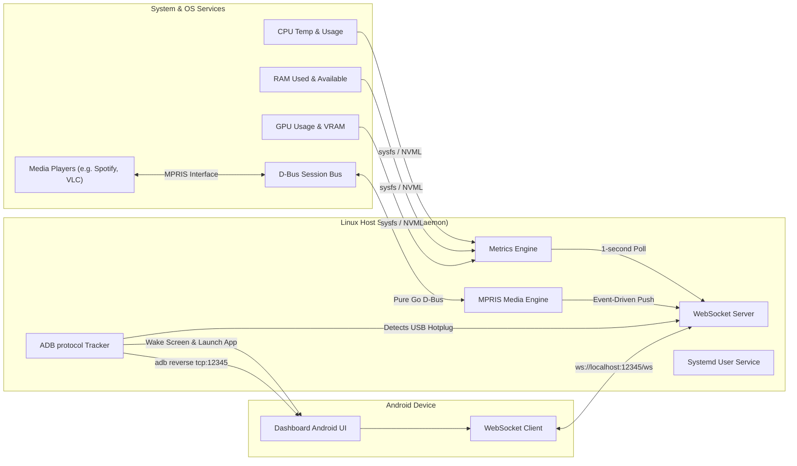

# Technical Specifications: PC Dashboard Server

## 1. Executive Summary & Purpose

The **PC Dashboard Server** is a lightweight, low-overhead system daemon written in Go for Linux host systems. It works in tandem with a companion Android application (expected to be preinstalled on an Android device connected via USB) to turn the mobile device into a dedicated, real-time hardware status monitor and dashboard.

By using physical USB connections instead of local Wi-Fi networks, the system achieves sub-millisecond network latencies, eliminates wireless bandwidth contention, runs securely inside local host loops, and is impervious to external network eavesdropping or packet injection.

---

## 2. High-Level System Architecture



---

## 3. Core Requirements & Component Details

### 3.1. Telemetry Collection Engine
The Telemetry engine gathers host statistics every 1.0 second (hardcoded interval) with low resource overhead. It must run asynchronously and gracefully handle hardware setups that lack dedicated components (e.g. integrated graphics only).

#### A. CPU Statistics
*   **Usage**: The overall CPU utilization percentage across all logical processors. Calculated dynamically by tracking differences in CPU tick times using `github.com/shirou/gopsutil/v4/cpu`.
*   **Temperature**: Read from Linux `/sys/` interface.
    *   *Primary Route*: Thermal Zones: `/sys/class/thermal/thermal_zone*/temp` (selecting zones where `type` contains `x86_pkg_temp`, `cpu-thermal`, or `coretemp`).
    *   *Secondary Route*: Hwmon sensors: `/sys/class/hwmon/hwmon*/temp*_input` matching label files containing `Package` or `Core`.

#### B. Memory (RAM) Statistics
*   **Total / Used / Available**: Read in bytes.
*   **Utilization**: Total RAM utilization percentage.
*   **Retrieval**: Captured from `/proc/meminfo` via `github.com/shirou/gopsutil/v4/mem`.

#### C. Graphics Processor (GPU & VRAM) Statistics
The daemon supports both NVIDIA (proprietary) and open-source AMD/Intel graphics drivers.
*   **NVIDIA GPUs**:
    *   *Primary Method*: Communicate with the local **NVML (NVIDIA Management Library)** using standard Go API bindings (or lightweight CGO-free bindings) to extract core GPU utilization percentage, VRAM utilization, and temperature.
    *   *Fallback Method*: Execute `nvidia-smi` as an external command:
        ```bash
        nvidia-smi --query-gpu=temperature.gpu,utilization.gpu,memory.used,memory.total --format=csv,noheader,nounits
        ```
*   **AMD & Intel GPUs (sysfs / hwmon)**:
    *   *GPU Busy Percentage*: Read `/sys/class/drm/card0/device/gpu_busy_percent` (or `/sys/class/drm/card0/device/pm_info`).
    *   *VRAM Bytes Used*: Read `/sys/class/drm/card0/device/mem_info_vram_used`.
    *   *VRAM Bytes Total*: Read `/sys/class/drm/card0/device/mem_info_vram_total`.
    *   *GPU Temperature*: Read `/sys/class/drm/card0/device/hwmon/hwmon*/temp1_input`.

---

### 3.2. USB Discovery & ADB Bootstrapping Protocol
The daemon automatically establishes connection pathways with the Android companion device once connected via USB.

#### A. Device Connection Detection
Rather than executing external `adb devices` calls inside polling loops, the Go daemon utilizes direct TCP sockets over ADB's native client-server protocol.
1.  Connect via TCP socket to the ADB server on `127.0.0.1:5037`.
2.  Transmit the protocol command: `host:track-devices` (preceded by a 4-hex-character length descriptor: `0012host:track-devices`).
3.  The ADB server will stream updates whenever physical USB devices are plugged in, removed, or change state (e.g. `[serial] online`, `[serial] offline`).

#### B. Companion App Bootstrapping
When the target Android device transitions to the `online` state, the daemon initiates a three-step bootstrap:
1.  **Screen Wakeup**: Transmit raw ADB socket packet `shell:input keyevent KEYCODE_WAKEUP` to wake the screen. (Skipped if `--no-app-control` is active).
2.  **App Launch**: Launch the companion application (expected to be preinstalled on the device) by sending:
    ```
    shell:am start -n com.noosxe.pc_dashboard/com.noosxe.pc_dashboard.MainActivity
    ```
    (Skipped if `--no-app-control` is active).
3.  **Port Redirection**: Send a reverse connection request:
    ```
    reverse:forward:tcp:12345;tcp:12345
    ```
    This instructs the Android ADB service to dynamically listen on the mobile device's local port `12345` and securely tunnel all connections to the host PC's local port `12345` over the physical USB bus.

---

### 3.3. WebSocket API & Messaging Schemas
The daemon hosts a WebSocket server binding strictly to the local loopback address `127.0.0.1:12345`. The communication is fully bidirectional.

#### A. Outbound Telemetry Message (Host → Android Client)
Pushed automatically once every second.
*   **Path**: `ws://127.0.0.1:12345/ws`
*   **Schema**:
```json
{
  "type": "telemetry",
  "timestamp": 1716213825,
  "data": {
    "cpu": {
      "usage_percent": 18.7,
      "temp_celsius": 49.0
    },
    "gpu": {
      "usage_percent": 41.0,
      "temp_celsius": 58.0,
      "vram_used_bytes": 3121561600,
      "vram_total_bytes": 8589934592
    },
    "ram": {
      "used_bytes": 14212567040,
      "total_bytes": 34359738368,
      "percentage": 41.3
    }
  }
}
```

#### B. Inbound Control Messages (Android Client → Host)
The companion app can transmit real-time controls back to the daemon:
*   **Ping / Connection Keepalive**:
    ```json
    { "type": "ping" }
    ```
    *Response from Host:* `{"type": "pong"}`
*   **Update Interval Configuration** (for future expansion, currently defaults to 1000ms):
    ```json
    {
      "type": "config",
      "settings": {
        "interval_ms": 1000
      }
    }
    ```
*   **System Action Commands**:
    ```json
    {
      "type": "action",
      "command": "suspend"
    }
    ```

---

### 3.4. Application Configuration Management
The daemon uses **`koanf`** to load and merge configurations from multiple sources into a unified, strongly-typed internal settings structure. 

#### A. Configuration Hierarchy (Precedence)
Settings are resolved in the following order of precedence (highest to lowest):
1.  **Command-Line Flags**: Parsed via `cobra` / `pflag` and bound to `koanf`.
    *   `--verbose`, `-v`: Unconditionally force log level to `debug`.
    *   `--log-level`: Set structured logging level (`debug`, `info`, `warn`, `error`). Default is `info`.
    *   `--log-format`: Set structured log output format (`text`, `json`). Default is `text`.
2.  **Environment Variables**: Prefixed with `PCD_` (e.g., `PCD_SERVER_PORT`, `PCD_DAEMON_LOG_LEVEL`, `PCD_DAEMON_LOG_FORMAT`).
3.  **Local Configuration File**: An optional YAML file located at `~/.config/pc-dashboard/config.yaml`.
4.  **Internal Defaults**: Safe fallback values compiled directly into the binary.

#### B. Configuration Schema (YAML Example)
```yaml
server:
  host: "127.0.0.1"
  port: 12345

daemon:
  update_interval_ms: 1000
  log_level: "info"
  log_format: "text"

adb:
  server_host: "127.0.0.1"
  server_port: 5037
  target_package: "com.noosxe.pc_dashboard"
  target_activity: "com.noosxe.pc_dashboard.MainActivity"
  no_app_control: false
```

---

### 3.5. Operational Specifications (Systemd Daemon)
The PC Dashboard Server operates as a **user-level systemd service** (`systemd --user`). This design ensures that:
*   The application runs inside the desktop user's session space, inheriting authorization settings for local audio/video, display variables, and graphic drivers (NVML).
*   No elevated root privileges are required to run the service, adhering strictly to the principle of least privilege.
*   The service launches automatically upon user login or desktop session activation.

#### User Systemd Configuration File
`~/.config/systemd/user/pc-dashboard.service`

```ini
[Unit]
Description=PC Dashboard Server Daemon
After=network.target adb.service
Documentation=https://github.com/noosxe/pc-dashboard-server

[Service]
Type=simple
ExecStart=/usr/local/bin/pc-dashboard-server start
Restart=on-failure
RestartSec=3s
Environment=LOG_LEVEL=info

[Install]
WantedBy=default.target
```

#### Service Management Commands
```bash
# Reload user systemd daemon configs
systemctl --user daemon-reload

# Enable and start the service
systemctl --user enable pc-dashboard.service
systemctl --user start pc-dashboard.service

# View real-time daemon logs
journalctl --user -u pc-dashboard.service -f -n 100
```

---

### 3.6. Media & Player Control Engine (MPRIS via D-Bus)
The PC Dashboard Server leverages the **D-Bus Session Bus** to dynamically discover, track, and control active media players running in the user desktop space via the **MPRIS (Media Player Remote Interfacing Specification)** standard.

#### A. Player Discovery & Tracking
1.  **D-Bus Session Connection**: The daemon connects to the session D-Bus. Since it runs as a user systemd service, it operates within the logged-in user session, having direct, secure access to the user's D-Bus sockets without requiring elevated root permissions.
2.  **Dynamic Discovery**:
    *   **Listing Players**: The daemon queries the D-Bus interface `org.freedesktop.DBus` by invoking `ListNames` on path `/org/freedesktop/DBus` to find all services matching the prefix `org.mpris.MediaPlayer2.*`.
    *   **Hot-Detection**: Rather than polling, the daemon registers to receive `org.freedesktop.DBus.NameOwnerChanged` signals on `/org/freedesktop/DBus` to immediately catch when media players are spawned (e.g. user opens Spotify) or closed (name owner changes to empty).
3.  **Property & State Monitoring**:
    *   For each active player, the daemon registers to listen for `org.freedesktop.DBus.Properties.PropertiesChanged` signals at object path `/org/mpris/MediaPlayer2` for the interface `org.mpris.MediaPlayer2.Player`.
    *   This ensures that changes in metadata (track title, artist, art URL, length), playback status (`Playing`, `Paused`, `Stopped`), volume level, or playback position are caught via instant, event-driven callbacks.

#### B. Media Player Control API
The companion Android app can issue real-time media player commands back to the daemon over the WebSocket connection. The daemon maps these JSON payloads into standard D-Bus method calls targeting the `org.mpris.MediaPlayer2.Player` interface at `/org/mpris/MediaPlayer2` on the specific player's D-Bus name.
*   **Methods Supported**:
    *   `Next`: Moves to the next track.
    *   `Previous`: Moves to the previous track.
    *   `PlayPause`: Toggles the playback state.
    *   `Play`: Resumes playback.
    *   `Pause`: Pauses playback.
    *   `Stop`: Stops playback.
    *   `Seek` (Argument: `Offset` in microseconds): Relative seek.
    *   `SetPosition` (Arguments: `TrackId` as string, `Position` in microseconds): Absolute seek to track position.
    *   `Volume` (Property write: float double 0.0 to 1.0): Updates player volume.

---

### 3.7. Desktop Notification Sync (D-Bus)
The PC Dashboard Server leverages the **D-Bus Session Bus** to dynamically intercept desktop notifications sent by other applications and forward them to the companion Android app, as well as to publish notifications triggered by the companion app or daemon itself back to the host system.

#### A. Notification Eavesdropping & ID Interception
To catch notifications non-disruptively without interfering with the desktop environment's own notification daemon, the server configures its D-Bus connection as a monitor.
1.  **D-Bus Monitor Mode**: The daemon calls `BecomeMonitor` on the D-Bus interface `org.freedesktop.DBus.Monitoring` at `/org/freedesktop/DBus`.
2.  **Match Rules**: The monitor registration passes rules to listen for both the inbound method calls and outbound method returns of standard notifications:
    ```
    type='method_call',interface='org.freedesktop.Notifications',member='Notify'
    type='method_return'
    ```
3.  **Non-Disruptive Flow**: The session bus routes duplicates of these frames to our monitor connection. The original flows between the client apps and the desktop notification service are completely untouched.
4.  **Payload Extraction**: The daemon intercepts the `Notify` method call arguments: `AppName` (string), `ReplacesID` (uint32), `AppIcon` (string), `Summary` (string), `Body` (string), `Actions` (array of strings), `Hints` (dictionary), and `ExpireTimeout` (int32).
5.  **Asynchronous ID Correlation**: Since system-assigned notification IDs are returned asynchronously in the method reply, the daemon caches the intercepted `Notify` payload in a thread-safe map keyed by the message `Serial()`. When the matching `method_return` is intercepted, its `ReplySerial` header is correlated back to the cached call. The generated notification `ID` (uint32) is extracted from the reply, attached to the notification event payload, and the event is broadcasted over WebSockets. A cache TTL of 5 seconds prevents memory leaks.

#### B. Notification Publishing API
The companion Android app or daemon can trigger new host system toasts by sending a notification request:
1.  **Method Invocation**: The daemon establishes a standard D-Bus connection and invokes `org.freedesktop.Notifications.Notify` targeting the service `org.freedesktop.Notifications` at path `/org/freedesktop/Notifications`.
2.  **Arguments Construction**: The call is constructed with the supplied message fields (`AppName`, `ReplacesID`, `AppIcon`, `Summary`, `Body`, `Actions`, `Hints`, `ExpireTimeout`).
3.  **Result Routing**: The D-Bus broker returns a unique `NotificationID` (uint32) upon success, which is mapped and routed back to the initiating client.

#### C. Notification Actions & Dismissal API
When a user interacts with a notification on the companion Android app, the app sends commands back to the server:
1.  **Invoking Actions**: To invoke an action (e.g. clicking a button), the companion app sends a `notification_action_command` with the `notification_id` and `action_key`. The daemon translates this into an `ActionInvoked` signal emitted on the session D-Bus bus:
    - **Object Path**: `/org/freedesktop/Notifications`
    - **Interface**: `org.freedesktop.Notifications`
    - **Signal Name**: `ActionInvoked`
    - **Parameters**: `id` (uint32), `action_key` (string)
    This broadcasts the action, alerting the original calling application to perform the requested flow (e.g., open a message).
2.  **Notification Dismissal**: When the companion app sends a `notification_dismiss_command` (or immediately following an action invocation to clean up), the daemon calls the D-Bus method `org.freedesktop.Notifications.CloseNotification` with the target `notification_id` as an argument to dismiss the visual toast on the host system desktop.

---

### 3.8. Session Lock & Screensaver Detection (D-Bus)
The PC Dashboard Server leverages both the **D-Bus Session Bus** and the **D-Bus System Bus** to dynamically track user desktop session lock and unlock states. This telemetry allows the Android companion client to enter sleeping mode after a timeout when the host PC is locked.

#### A. Screensaver Status Interception (Session Bus)
To support modern desktop environments (GNOME, KDE, Cinnamon, etc.) that manage screen locks via a user-session screensaver, the daemon connects to the D-Bus Session Bus:
1.  **Match Signal Rules**: The daemon registers match rules to listen for screensaver active/state changes:
    ```
    type='signal',interface='org.freedesktop.ScreenSaver',member='ActiveChanged'
    type='signal',interface='org.gnome.ScreenSaver',member='ActiveChanged'
    ```
2.  **State Parsing**: When an `ActiveChanged(bool)` signal is intercepted, the first body argument represents the screensaver state: `true` indicates the screensaver/lockscreen is active (session locked), and `false` indicates it is inactive (session unlocked).

#### B. User Session State Interception (System Bus via systemd-logind)
To capture physical console session locks managed by systemd, the daemon connects to the D-Bus System Bus:
1.  **Match Signal Rules**: The daemon registers match rules targeting systemd's `logind` session manager:
    ```
    type='signal',sender='org.freedesktop.login1',interface='org.freedesktop.login1.Session',member='Lock'
    type='signal',sender='org.freedesktop.login1',interface='org.freedesktop.login1.Session',member='Unlock'
    ```
2.  **State Parsing**: Intercepting the `Lock` signal designates transition to a locked session. Intercepting the `Unlock` signal designates transition to an unlocked session.

#### C. Unified Pipeline and Deduplication
Since multiple signals (e.g. systemd-logind `Lock` and GNOME Screensaver `ActiveChanged`) might fire simultaneously during a lock event, the daemon pipes both event sources into a unified engine. 
1.  **Deduplication**: The engine tracks the current session lock state. It deduplicates incoming events and only triggers an outbound WebSocket notification if a genuine transition has occurred.
2.  **Graceful Fallback**: If either bus connection or registration fails (e.g., in headless environments, containers, or systems without a system bus), the daemon logs a warning and gracefully operates using only the successful bus, ensuring continuous operation.

#### D. Companion App Screen Wake & Sleep Control (DPMS Sync)
Upon detecting lock state transitions (representing screen power changes/DPMS off/on events), the daemon uses native ADB protocol socket commands over TCP loopback to control the companion device's screen state:
1. **Screen Sleep (DPMS Off / Lock)**: When the session locks (screensaver active / physical console locked), the daemon uses raw TCP sockets on port `5037` to issue the non-toggling `shell:input keyevent KEYCODE_SLEEP` (keyevent `223`) command to the target Android companion app device. This puts the Android device's screen to sleep to conserve energy and match the host's screen-off state.
2. **Screen Wake (DPMS On / Unlock)**: When the session unlocks (screensaver inactive / physical console unlocked), the daemon issues the non-toggling `shell:input keyevent KEYCODE_WAKEUP` (keyevent `224`) command to the target Android companion app device, waking its screen to resume status visualization immediately.
3. **App-Control Bypass**: If the server configuration has `no_app_control` set to `true`, these automatic wakeup/sleep ADB signals are bypassed.

---

### 3.9. Power Profiles Control & Sync (D-Bus)
The PC Dashboard Server leverages the **D-Bus System Bus** to dynamically query available power profiles, track profile changes in real time, and control the active power profile on the host PC via the **`power-profiles-daemon`** standard system service.

#### A. Power Profile Discovery & Tracking
1. **D-Bus System Connection**: The daemon connects to the system bus (`dbus.ConnectSystemBus()`). This connects to the well-known D-Bus service `net.hadess.PowerProfiles` at object path `/net/hadess/PowerProfiles`.
2. **Initial State Fetching**:
   - **Available Profiles**: The daemon reads the `Profiles` property on the `net.hadess.PowerProfiles` interface. The property returns an array of dictionaries (`aa{sv}`). Each dictionary contains a `Profile` key (string) denoting a supported power profile (e.g., `power-saver`, `balanced`, `performance`).
   - **Active Profile**: The daemon reads the `ActiveProfile` property (string) to determine the current system power profile.
3. **Change Monitoring**:
   - The daemon registers to listen for `org.freedesktop.DBus.Properties.PropertiesChanged` signals at object path `/net/hadess/PowerProfiles` for interface `net.hadess.PowerProfiles`.
   - When the signal is received, the daemon checks if the `ActiveProfile` key exists in the changed properties map. If it does, the updated active profile name is extracted and immediately broadcasted to all active WebSocket clients.

#### B. Power Profile Control API
The companion Android app can issue real-time power profile commands back to the daemon over the WebSocket connection.
1. **Profile Validation**: Upon receiving a control request specifying a target profile name, the daemon validates that the requested profile is present in the cached list of available profiles.
2. **Property Write**: If valid, the daemon writes the new profile string to the `ActiveProfile` property on the D-Bus interface `net.hadess.PowerProfiles` at path `/net/hadess/PowerProfiles`.
3. **Bypass on Emulation**: If emulation mode is enabled (`--emulate-metrics`), the daemon simulates the profile transition in memory and broadcasts the updated state without contacting the system D-Bus.

---

### 3.10. Local Command Trigger Socket (Unix Domain Socket)
The PC Dashboard Server features a local Unix Domain Socket (UDS) command listener that allows CLI triggers to execute and relay state notifications to active WebSocket clients. This allows simulating and debugging companion application behaviors (e.g. rendering specific telemetry limits, desktop notification popups, session lock screens, or custom JSON formats) without having physical hardware access.

#### A. Socket Lifecycle & Binding
1. **Dynamic Runtime Resolution**: The socket binds to the local system path specified in the configuration. The default path resolves to `$XDG_RUNTIME_DIR/pc-dashboard-server.sock` (XDG-compliant user-specific runtime directory). If `$XDG_RUNTIME_DIR` is empty or missing, it falls back to the system temporary directory: `os.TempDir() + "/pc-dashboard-server.sock"`.
2. **Instance Exclusivity & Cleanup**: 
   - Upon startup, the daemon attempts to dial the existing socket file. If the dial succeeds, it indicates another daemon instance is already active, and the daemon exits with an error.
   - If the dial fails, the socket file is considered stale, deleted via `os.Remove`, and a new UDS listener is bound.
   - On clean engine shutdown, the socket file is unlinked (`os.Remove`) from the filesystem.

#### B. Command Socket Protocol
The client and server communicate using structured JSON over the Unix Domain Socket connection.
1. **Inbound UDS Request**: The client transmits a single UDSRequest:
   - `type` (string): The category of trigger (`session_lock`, `notification_event`, `media_state`, `telemetry`, `raw`).
   - `data` (RawMessage): The corresponding JSON data object.
2. **Outbound UDS Response**: The server processes the request, broadcasts the payload to all active WebSocket clients, and returns a single UDSResponse:
   - `success` (boolean): Whether the event was successfully processed and broadcasted.
   - `client_count` (int): The number of active clients the event was routed to.
   - `error` (string): An optional error description if the operation failed.

---

## 4. Security Model & Guidelines

To ensure maximum safety and protect the user's host machine, the daemon adheres to the following secure coding principles:

1.  **Strict Local Binding**: The WebSocket HTTP server must exclusively bind to local interface address `127.0.0.1` (or `::1`). Binding to any wildcard interface like `0.0.0.0` is strictly forbidden to prevent network-wide port exposure.
2.  **Explicit ADB TCP Boundaries**: All ADB communications are locked to local ADB server port `5037` over the loopback interface.
3.  **Command Execution Safety**: If external commands (like `nvidia-smi` or `systemctl`) must be invoked, the binary paths and query arguments must be strictly hardcoded or validated against a list of permitted commands. No unvalidated user strings may ever be passed to system shells.
4.  **Graceful Failures**: If system sensors are missing or fail to read, the monitoring threads must continue reporting remaining system stats gracefully rather than terminating the daemon.
5.  **No Credentials in Logs**: Logs outputted to systemd journal **MUST NOT** include any session tokens, client identities, or sensitive internal environmental keys.
6.  **Structured Log Sanitization**: All log outputs must use the standard `log/slog` structured library. Log messages and attributes must never print un-sanitized user inputs or raw connection buffer contents to prevent log injection vulnerabilities.
7.  **D-Bus Bound Validation**: Media player commands (such as Seek relative offsets and absolute Position microseconds) received via WebSockets must be validated for boundaries (e.g., negative length bounds, reasonable maximum volume float limits between `0.0` and `1.0`) before routing them to the host's D-Bus bus. This blocks malicious or erroneous WebSocket frames from sending out-of-range or malformed values to system applications.
8.  **Notification Safety Boundaries**: Notification summary and body fields received via WebSockets will be subject to strict length limitations (e.g., maximum 512 bytes for summary, 2048 bytes for body) and simple markup validation (stripping dangerous or invalid HTML elements) to prevent injection exploits in the host's notification daemon. The `Hints` dictionary must be restricted to verified safe primitive keys (e.g., `urgency`, `category`) to block serialization issues.
9.  **Lock State Isolation**: The outbound session lock status must only convey a simple binary status (`locked`: boolean). No active session names, user IDs, or environment details may ever be sent to the companion app, protecting user session privacy from physical/network exposure.
10. **Unix Domain Socket Isolation & Access Control**: The UDS listener restricts socket file permissions strictly to owner-only access (`0600` or `0700` directories) to prevent multi-user system privilege escalation or unauthorized local telemetry injections. All incoming payload keys are strictly unmarshalled and validated against strict schemas, blocking memory injection or structural corruption before distribution.
11. **Power Profile Input Sanitization**: Power profile selection commands received via WebSockets are strictly validated against the read-only list of available profiles fetched from the system D-Bus before execution. Any unrecognized strings are immediately dropped, preventing D-Bus property injection or arbitrary system parameter manipulation.
