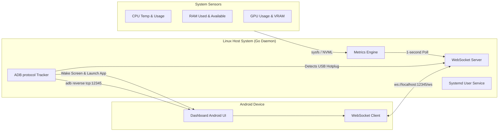

# Technical Specifications: PC Dashboard Server

## 1. Executive Summary & Purpose

The **PC Dashboard Server** is a lightweight, low-overhead system daemon written in Go for Linux host systems. It works in tandem with a companion Android application (expected to be preinstalled on an Android device connected via USB) to turn the mobile device into a dedicated, real-time hardware status monitor and dashboard.

By using physical USB connections instead of local Wi-Fi networks, the system achieves sub-millisecond network latencies, eliminates wireless bandwidth contention, runs securely inside local host loops, and is impervious to external network eavesdropping or packet injection.

---

## 2. High-Level System Architecture



---

## 3. Core Requirements & Component Details

### 3.1. Telemetry Collection Engine
The Telemetry engine gathers host statistics every 1.0 second (hardcoded interval) with low resource overhead. It must run asynchronously and gracefully handle hardware setups that lack dedicated components (e.g. integrated graphics only).

#### A. CPU Statistics
*   **Usage**: The overall CPU utilization percentage across all logical processors. Calculated dynamically by tracking differences in CPU tick times using `github.com/shirou/gopsutil/v4/cpu`.
*   **Temperature**: Read from Linux `/sys/` interface.
    *   *Primary Route*: Thermal Zones: `/sys/class/thermal/thermal_zone*/temp` (selecting zones where `type` contains `x86_pkg_temp`, `cpu-thermal`, or `coretemp`).
    *   *Secondary Route*: Hwmon sensors: `/sys/class/hwmon/hwmon*/temp*_input` matching label files containing `Package` or `Core`.

#### B. Memory (RAM) Statistics
*   **Total / Used / Available**: Read in bytes.
*   **Utilization**: Total RAM utilization percentage.
*   **Retrieval**: Captured from `/proc/meminfo` via `github.com/shirou/gopsutil/v4/mem`.

#### C. Graphics Processor (GPU & VRAM) Statistics
The daemon supports both NVIDIA (proprietary) and open-source AMD/Intel graphics drivers.
*   **NVIDIA GPUs**:
    *   *Primary Method*: Communicate with the local **NVML (NVIDIA Management Library)** using standard Go API bindings (or lightweight CGO-free bindings) to extract core GPU utilization percentage, VRAM utilization, and temperature.
    *   *Fallback Method*: Execute `nvidia-smi` as an external command:
        ```bash
        nvidia-smi --query-gpu=temperature.gpu,utilization.gpu,memory.used,memory.total --format=csv,noheader,nounits
        ```
*   **AMD & Intel GPUs (sysfs / hwmon)**:
    *   *GPU Busy Percentage*: Read `/sys/class/drm/card0/device/gpu_busy_percent` (or `/sys/class/drm/card0/device/pm_info`).
    *   *VRAM Bytes Used*: Read `/sys/class/drm/card0/device/mem_info_vram_used`.
    *   *VRAM Bytes Total*: Read `/sys/class/drm/card0/device/mem_info_vram_total`.
    *   *GPU Temperature*: Read `/sys/class/drm/card0/device/hwmon/hwmon*/temp1_input`.

---

### 3.2. USB Discovery & ADB Bootstrapping Protocol
The daemon automatically establishes connection pathways with the Android companion device once connected via USB.

#### A. Device Connection Detection
Rather than executing external `adb devices` calls inside polling loops, the Go daemon utilizes direct TCP sockets over ADB's native client-server protocol.
1.  Connect via TCP socket to the ADB server on `127.0.0.1:5037`.
2.  Transmit the protocol command: `host:track-devices` (preceded by a 4-hex-character length descriptor: `0012host:track-devices`).
3.  The ADB server will stream updates whenever physical USB devices are plugged in, removed, or change state (e.g. `[serial] online`, `[serial] offline`).

#### B. Companion App Bootstrapping
When the target Android device transitions to the `online` state, the daemon initiates a three-step bootstrap:
1.  **Screen Wakeup**: Transmit raw ADB socket packet `shell:input keyevent KEYCODE_WAKEUP` to wake the screen.
2.  **App Launch**: Launch the companion application (expected to be preinstalled on the device) by sending:
    ```
    shell:am start -n com.noosxe.pc_dashboard/com.noosxe.pc_dashboard.MainActivity
    ```
3.  **Port Redirection**: Send a reverse connection request:
    ```
    reverse:forward:tcp:12345;tcp:12345
    ```
    This instructs the Android ADB service to dynamically listen on the mobile device's local port `12345` and securely tunnel all connections to the host PC's local port `12345` over the physical USB bus.

---

### 3.3. WebSocket API & Messaging Schemas
The daemon hosts a WebSocket server binding strictly to the local loopback address `127.0.0.1:12345`. The communication is fully bidirectional.

#### A. Outbound Telemetry Message (Host → Android Client)
Pushed automatically once every second.
*   **Path**: `ws://127.0.0.1:12345/ws`
*   **Schema**:
```json
{
  "type": "telemetry",
  "timestamp": 1716213825,
  "data": {
    "cpu": {
      "usage_percent": 18.7,
      "temp_celsius": 49.0
    },
    "gpu": {
      "usage_percent": 41.0,
      "temp_celsius": 58.0,
      "vram_used_bytes": 3121561600,
      "vram_total_bytes": 8589934592
    },
    "ram": {
      "used_bytes": 14212567040,
      "total_bytes": 34359738368,
      "percentage": 41.3
    }
  }
}
```

#### B. Inbound Control Messages (Android Client → Host)
The companion app can transmit real-time controls back to the daemon:
*   **Ping / Connection Keepalive**:
    ```json
    { "type": "ping" }
    ```
    *Response from Host:* `{"type": "pong"}`
*   **Update Interval Configuration** (for future expansion, currently defaults to 1000ms):
    ```json
    {
      "type": "config",
      "settings": {
        "interval_ms": 1000
      }
    }
    ```
*   **System Action Commands**:
    ```json
    {
      "type": "action",
      "command": "suspend"
    }
    ```

---

### 3.4. Application Configuration Management
The daemon uses **`koanf`** to load and merge configurations from multiple sources into a unified, strongly-typed internal settings structure. 

#### A. Configuration Hierarchy (Precedence)
Settings are resolved in the following order of precedence (highest to lowest):
1.  **Command-Line Flags**: Parsed via `cobra` / `pflag` and bound to `koanf`.
2.  **Environment Variables**: Prefixed with `PCD_` (e.g., `PCD_SERVER_PORT`).
3.  **Local Configuration File**: An optional YAML file located at `~/.config/pc-dashboard/config.yaml`.
4.  **Internal Defaults**: Safe fallback values compiled directly into the binary.

#### B. Configuration Schema (YAML Example)
```yaml
server:
  host: "127.0.0.1"
  port: 12345

daemon:
  update_interval_ms: 1000
  log_level: "info"

adb:
  server_host: "127.0.0.1"
  server_port: 5037
  target_package: "com.noosxe.pc_dashboard"
  target_activity: "com.noosxe.pc_dashboard.MainActivity"
```

---

### 3.5. Operational Specifications (Systemd Daemon)
The PC Dashboard Server operates as a **user-level systemd service** (`systemd --user`). This design ensures that:
*   The application runs inside the desktop user's session space, inheriting authorization settings for local audio/video, display variables, and graphic drivers (NVML).
*   No elevated root privileges are required to run the service, adhering strictly to the principle of least privilege.
*   The service launches automatically upon user login or desktop session activation.

#### User Systemd Configuration File
`~/.config/systemd/user/pc-dashboard.service`

```ini
[Unit]
Description=PC Dashboard Server Daemon
After=network.target adb.service
Documentation=https://github.com/noosxe/pc-dashboard-server

[Service]
Type=simple
ExecStart=/usr/local/bin/pc-dashboard-server start
Restart=on-failure
RestartSec=3s
Environment=LOG_LEVEL=info

[Install]
WantedBy=default.target
```

#### Service Management Commands
```bash
# Reload user systemd daemon configs
systemctl --user daemon-reload

# Enable and start the service
systemctl --user enable pc-dashboard.service
systemctl --user start pc-dashboard.service

# View real-time daemon logs
journalctl --user -u pc-dashboard.service -f -n 100
```

---

## 4. Security Model & Guidelines

To ensure maximum safety and protect the user's host machine, the daemon adheres to the following secure coding principles:

1.  **Strict Local Binding**: The WebSocket HTTP server must exclusively bind to local interface address `127.0.0.1` (or `::1`). Binding to any wildcard interface like `0.0.0.0` is strictly forbidden to prevent network-wide port exposure.
2.  **Explicit ADB TCP Boundaries**: All ADB communications are locked to local ADB server port `5037` over the loopback interface.
3.  **Command Execution Safety**: If external commands (like `nvidia-smi` or `systemctl`) must be invoked, the binary paths and query arguments must be strictly hardcoded or validated against a strict allow-list. No unvalidated user strings may ever be passed to system shells.
4.  **Graceful Failures**: If system sensors are missing or fail to read, the monitoring threads must continue reporting remaining system stats gracefully rather than terminating the daemon.
5.  **No Credentials in Logs**: Logs outputted to systemd journal **MUST NOT** include any session tokens, client identities, or sensitive internal environmental keys.
